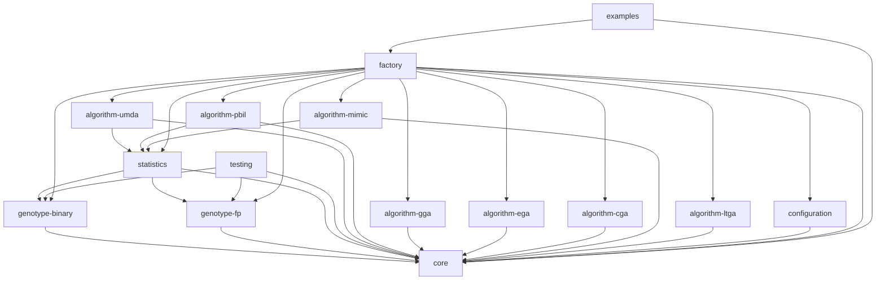

# Estimation of Distribution Algorithms Framework (EDAF)

Estimation of distribution algorithms (EDAs), sometimes called probabilistic 
model-building genetic algorithms (PMBGAs), are stochastic optimization methods 
that guide the search for the optimum by building and sampling explicit probabilistic 
models of promising candidate solutions. Optimization is viewed as a series of
incremental updates of a probabilistic model, starting with the model
encoding the uniform distribution over admissible solutions and ending with
the model that generates only the global optima.

This is a completely redesigned and rebuilt Java framework for Estimation of Distribution Algorithms (EDAs), based on the original work by Karlo Knezevic.

## Architecture

The framework is designed with a modular and extensible architecture. It is built with Java 17+ and Maven.
The main components are defined by interfaces in the `core` module, and the implementations are provided in separate modules.

### Modules

Here is a diagram of the module dependencies:



*   `core`: Core interfaces and classes.
*   `genotype-binary`: Binary genotype implementation.
*   `genotype-fp`: Floating-point genotype implementation.
*   `algorithm-umda`: UMDA algorithm implementation.
*   `algorithm-pbil`: PBIL algorithm implementation.
*   `algorithm-gga`: Generational Genetic Algorithm implementation.
*   `statistics`: Statistics implementations.
*   `configuration`: Configuration loading from YAML files.
*   `testing`: Testing utilities.
*   `examples`: Usage examples.

## How to Build

The project is built with Maven. To build the project, run the following command from the root directory:

```
mvn clean install
```

This will compile all the modules and create the JAR files in the `target` directory of each module.

## How to Run

The framework is run from the command line using the executable JAR file produced by the `examples` module.
After building the project with `mvn clean install`, you can find this JAR at `examples/target/examples-2.0.0-SNAPSHOT-jar-with-dependencies.jar`.

The framework now provides a command-line interface (CLI) with several options. You can get help by running:
```
java -jar examples/target/examples-2.0.0-SNAPSHOT-jar-with-dependencies.jar --help
```

### Running an Experiment

To run an experiment, simply provide the path to a valid configuration file:
```
java -jar examples/target/examples-2.0.0-SNAPSHOT-jar-with-dependencies.jar examples/config/cga-max-ones.yaml
```
The framework will print its progress to the console.

### Generating a Configuration Template

To make it easier to create new configuration files, you can use the `generate-config` command.
This will generate a template for a given algorithm and print it to the console.

```
java -jar examples/target/examples-2.0.0-SNAPSHOT-jar-with-dependencies.jar generate-config --algorithm cGA
```
You can redirect the output to a file:
```
java -jar examples/target/examples-2.0.0-SNAPSHOT-jar-with-dependencies.jar generate-config -a eGA > my-ega-config.yaml
```

## Logging

The framework uses a robust logging system.
*   **Console Output:** General progress and informational messages are printed to the console in a human-readable format.
*   **Log File:** Detailed logs are written to `edaf.log`.
*   **Results File:** The final result of each run is written to `results.json` in a structured JSON format, which is easy to parse for automated analysis.

## Configuration

The framework uses YAML files for configuration.

### Validation
The framework automatically validates the configuration file upon loading. If any required parameters are missing or have invalid values, it will print a clear error message and exit. This prevents runtime errors due to misconfiguration.

### Available Components

Here is a list of the currently available components that can be specified in the configuration file.

**Genotypes (`genotype.type`)**
| Name      | Description                               |
|-----------|-------------------------------------------|
| `binary`  | A genotype represented by a binary string.  |
| `fp`      | A genotype represented by floating-point numbers. |
| `integer` | A genotype represented by integers.       |

**Selection (`selection.name`)**
| Name            | Description                               |
|-----------------|-------------------------------------------|
| `tournament`    | Tournament selection.                     |
| `rouletteWheel` | Roulette wheel selection.                 |

**Crossover (`crossing.name`)**
| Genotype  | Name          | Description                   | Parameters |
|-----------|---------------|-------------------------------|------------|
| `binary`  | `onePoint`    | One-point crossover.          | - |
| `binary`  | `uniform`     | Uniform crossover.            | - |
| `integer` | `onePoint`    | One-point crossover.          | - |
| `integer` | `twoPoint`    | Two-point crossover.          | - |
| `fp`      | `sbx`         | Simulated Binary Crossover.   | `distribution-index` |

**Mutation (`mutation.name`)**
| Genotype  | Name         | Description                  | Parameters |
|-----------|--------------|------------------------------|------------|
| `binary`  | `simple`     | Simple bit-flip mutation.    | `probability` |
| `integer` | `simple`     | Simple integer mutation.     | `probability` |
| `fp`      | `polynomial` | Polynomial mutation.         | `probability`, `distribution-index` |


### Extending the Framework

You can extend the framework by adding your own custom problems. Here are the steps to do that:

1.  **Create a new problem class.** Your class must implement the `hr.fer.zemris.edaf.core.Problem` interface.
    This interface has a single method, `evaluate(Individual individual)`, which you need to implement.
    For example, you could create a `MyProblem.java` file in your own package.

    ```java
    package com.mycompany.myproject;

    import hr.fer.zemris.edaf.core.api.*;
import hr.fer.zemris.edaf.core.impl.*;
    import hr.fer.zemris.edaf.core.api.*;
import hr.fer.zemris.edaf.core.impl.*;

    public class MyProblem implements Problem {
        @Override
        public void evaluate(Individual individual) {
            // Your evaluation logic here
        }
    }
    ```

2.  **Update the configuration file.** In your YAML configuration file, you need to specify the fully qualified name of your new problem class.

    ```yaml
    problem:
        name: com.mycompany.myproject.MyProblem
        # other problem parameters...
    ```

3.  **Build and run.** Rebuild the project with `mvn clean install` to include your new class.
    Then, you can run the framework with your new configuration file.