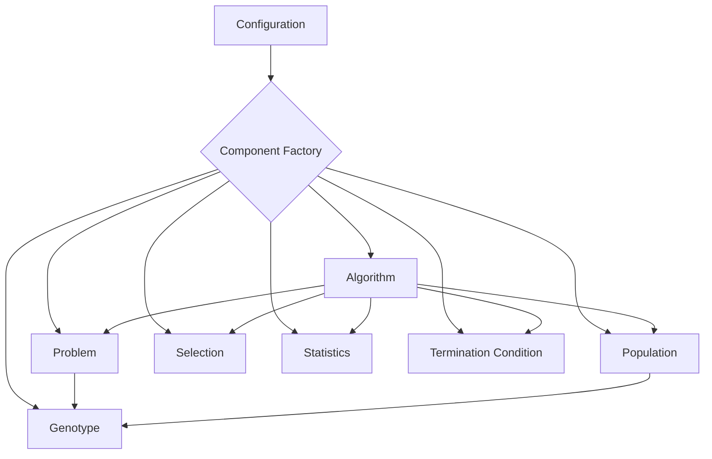

# Estimation of Distribution Algorithms Framework (EDAF)


[](LICENSE)

**EDAF** is a powerful and flexible Java framework for Estimation of Distribution Algorithms (EDAs) and other Evolutionary Algorithms (EAs). It provides a modular and extensible architecture that allows you to easily implement and experiment with different algorithms, genotypes, and operators.

This document provides a comprehensive overview of the framework, including its architecture, available components, and instructions on how to use it.

**Karlo Knezevic** 2013. *Evolucijski algoritmi temeljeni na vjerojatnosnim razdiobama* (Croatian language). *Master thesis, Nr. 540*, Faculty of Electrical Engineering and Computing, University of Zagreb. [Google Scholar](https://scholar.google.hr/citations?view_op=view_citation&hl=en&user=vrxkfe0AAAAJ&citation_for_view=vrxkfe0AAAAJ:UeHWp8X0CEIC)


## Table of Contents

- [Architecture](#architecture)
- [Getting Started](#getting-started)
- [Configuration](#configuration)
- [Algorithms](#algorithms)
- [Genotypes](#genotypes)
- [Operators](#operators)
- [Extending the Framework](#extending-the-framework)
- [How to Build](#how-to-build)
- [License](#license)

## Architecture

The framework is designed with a modular and extensible architecture. The core components are decoupled, allowing you to easily swap them out or add new ones.

The following Mermaid diagram illustrates the high-level architecture of the framework:



The `ComponentFactory` is responsible for creating all the necessary components based on the configuration file. The `Problem` component defines the optimization problem, including the fitness function and whether the goal is to `min` or `max` the fitness. This allows you to easily configure your experiment without changing the source code.

## Getting Started

To get started with EDAF, you need to provide a YAML configuration file that defines the experiment you want to run. You can use the `generate-config` command to generate a template configuration file:

```bash
java -jar examples/target/edaf.jar generate-config --algorithm gga > config.yaml
```

This will create a `config.yaml` file with a default configuration for the Generational Genetic Algorithm (gGA). You can then modify this file to suit your needs.

To run the experiment, simply provide the configuration file path:

```bash
java -jar examples/target/edaf.jar examples/config/umda-max-ones.yaml
```

For reproducible runs, use the `--seed` option:

```bash
java -jar examples/target/edaf.jar --seed 12345 examples/config/umda-max-ones.yaml
```

To enable metrics collection:

```bash
java -jar examples/target/edaf.jar --metrics examples/config/umda-max-ones.yaml
```

For Prometheus metrics endpoint:

```bash
java -jar examples/target/edaf.jar --prometheus-port 9464 examples/config/umda-max-ones.yaml
```

## Configuration

The configuration is done through a YAML file. The following sections describe the main configuration options.

### Problem

The `problem` section defines the problem to be solved.

| Parameter | Description |
| --- | --- |
| `class` | The fully qualified name of the problem class. |
| `optimization` | The optimization goal (`min` or `max`). Defaults to `min`. |
| `genotype` | The genotype configuration. |
| `parameters` | A map of parameters for the problem. |

### Genotype

The `genotype` section defines the genotype representation.

| Parameter | Description |
| --- | --- |
| `type` | The type of the genotype (`binary`, `fp`, `integer`, `permutation`, `tree`). |
| `length` | The length of the genotype. |
| `lowerBound` | The lower bound for floating-point genotypes. |
| `upperBound` | The upper bound for floating-point genotypes. |
| `minBound` | The minimum value for integer genotypes. |
| `maxBound` | The maximum value for integer genotypes. |
| `maxDepth` | The maximum depth for tree genotypes. |
| `crossing` | The crossover operator configuration. |
| `mutation` | The mutation operator configuration. |

### Algorithm

The `algorithm` section defines the algorithm to be used.

| Parameter | Description |
| --- | --- |
| `name` | The name of the algorithm. |
| `population` | The population configuration. |
| `selection` | The selection operator configuration. |
| `termination` | The termination condition configuration. |
| `elitism` | The number of best individuals to carry over to the next generation. |
| `parameters` | A map of parameters for the algorithm. |

## Algorithms

The framework includes implementations of 14 popular evolutionary algorithms:

**Estimation of Distribution Algorithms (EDAs):**
- **UMDA:** Univariate Marginal Distribution Algorithm - assumes variable independence
- **PBIL:** Population-Based Incremental Learning - maintains single probability vector
- **MIMIC:** Mutual-Information-Maximizing Input Clustering - chain-based dependencies
- **BMDA:** Bivariate Marginal Distribution Algorithm - pairwise dependencies
- **FDA:** Factorized Distribution Algorithm - Bayesian network with learned structure
- **CEM:** Cross-Entropy Method - black-box optimization with adaptive distribution
- **BOA:** Bayesian Optimization Algorithm - uses Gaussian Process surrogate
- **CGA:** Compact Genetic Algorithm - memory-efficient probability vector

**Genetic Algorithms (GAs):**
- **GGA:** Generational Genetic Algorithm - traditional GA with full replacement
- **EGA:** Eliminative Genetic Algorithm - steady-state with single replacement
- **LTGA:** Linkage Tree Genetic Algorithm - learns variable dependencies

**Genetic Programming:**
- **GP:** Standard Genetic Programming - evolves program trees
- **CGP:** Cartesian Genetic Programming - graph-based program representation

For detailed information about each algorithm, including parameters, complexity analysis, and when to use them, see the [Algorithms Reference](./docs/algorithms.md).

## Genotypes

The framework supports the following genotype representations:

- **Binary:** A genotype represented by a string of bits.
- **Floating-point (fp):** A genotype represented by a vector of real numbers.
- **Integer:** A genotype represented by a vector of integers.
- **Permutation:** A genotype represented by a permutation of integers.
- **Tree:** A genotype represented by a tree structure, used in Genetic Programming.

## Quick Start Guide

### 1. Build the Framework

```bash
mvn clean install
```

This creates the executable JAR at `examples/target/edaf.jar`.

### 2. Run an Example

```bash
java -jar examples/target/edaf.jar examples/config/umda-max-ones.yaml
```

### 3. View Results

Results are displayed in multiple ways:

#### Console Output

**Progress Bar:**
- Real-time generation progress with estimated time
- Compact statistics per generation (best, average, std dev)
- Example: `Generations   45% [████████████          ]      45/100 gen (0:00:23 / 0:00:51)`

**Statistics Table:**
- Detailed statistics displayed every 10 generations (and on generation 1)
- Includes: Best, Worst, Average (μ), Std Dev (σ), Median fitness values
- Color-coded with ASCII box-drawing characters for professional formatting
- Independent of Prometheus (always displayed)

**Final Results:**
- Best fitness value displayed at end of execution

#### Log Files

- **`edaf.log`**: Detailed execution logs with timestamps
- **`results.json`**: Structured JSON output with best individual and fitness

#### Prometheus Metrics (Optional)

Enable with `--prometheus-port`:
```bash
java -jar examples/target/edaf.jar --prometheus-port 8888 examples/config/umda-max-ones.yaml
```

Then configure Prometheus to scrape metrics from `http://localhost:8888/metrics`.

See [USAGE.md](USAGE.md) for detailed Prometheus setup instructions.

## Operators

The framework provides a variety of operators for selection, crossover, and mutation.

### Selection

- **Tournament Selection:** Selects individuals by running a tournament among a random subset of the population
- **Roulette Wheel Selection:** Selects individuals with a probability proportional to their fitness

### Crossover

| Genotype | Crossover Operators |
| --- | --- |
| Binary | `one-point`, `uniform` |
| Integer | `one-point`, `two-point` |
| Floating-point | `sbx` (Simulated Binary Crossover), `discrete`, `simple-arithmetic`, `whole-arithmetic` |
| Permutation | `pmx` (Partially Mapped), `ox` (Order), `cx` (Cycle) |
| Tree | `treeCrossover` |

### Mutation

| Genotype | Mutation Operators |
| --- | --- |
| Binary | `simple` |
| Integer | `simple` |
| Floating-point | `polynomial` |
| Permutation | `swap`, `insert`, `inversion`, `scramble`, `shift` |
| Tree | `treeMutation` |

## Extending the Framework

The framework is designed to be easily extended. You can add new algorithms, genotypes, and operators by implementing the corresponding interfaces and registering them in the factories.

For more details, please refer to the [Extending the Framework](./docs/extending-the-framework.md) documentation.

## How to Build

The project is built with Maven. To build the project, run the following command from the root directory:

```
mvn clean install
```

## License

EDAF (Estimation of Distribution Algorithms Framework)  
Copyright (C) 2026 Dr. Karlo Knežević

This project is licensed under the terms of the GNU General Public License v3.0.  
See the [LICENSE](LICENSE) file for details.
