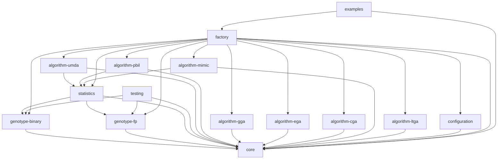

# Estimation of Distribution Algorithms Framework (EDAF)

Estimation of distribution algorithms (EDAs), sometimes called probabilistic 
model-building genetic algorithms (PMBGAs), are stochastic optimization methods 
that guide the search for the optimum by building and sampling explicit probabilistic 
models of promising candidate solutions. Optimization is viewed as a series of
incremental updates of a probabilistic model, starting with the model
encoding the uniform distribution over admissible solutions and ending with
the model that generates only the global optima.

This is a completely redesigned and rebuilt Java framework for Estimation of Distribution Algorithms (EDAs), based on the original work by Karlo Knezevic.

## Architecture

The framework is designed with a modular and extensible architecture. It is built with Java 17+ and Maven.
The main components are defined by interfaces in the `core` module, and the implementations are provided in separate modules.

### Modules

Here is a diagram of the module dependencies:



*   `core`: Core interfaces and classes.
*   `genotype-binary`: Binary genotype implementation.
*   `genotype-fp`: Floating-point genotype implementation.
*   `algorithm-umda`: UMDA algorithm implementation.
*   `algorithm-pbil`: PBIL algorithm implementation.
*   `algorithm-gga`: Generational Genetic Algorithm implementation.
*   `statistics`: Statistics implementations.
*   `configuration`: Configuration loading from YAML files.
*   `testing`: Testing utilities.
*   `examples`: Usage examples.

## How to Build

The project is built with Maven. To build the project, run the following command from the root directory:

```
mvn clean install
```

This will compile all the modules and create the JAR files in the `target` directory of each module.

## How to Run

The `examples` module contains a `Framework` class with a `main` method that can be used to run experiments.
You can run this class from your IDE or from the command line.

To run an example, you need to provide a path to a configuration file in YAML format.
An example configuration file `config.yaml` is provided in the root directory.

To run the example from the command line, use the `exec-maven-plugin`:
```
mvn -f examples/pom.xml exec:java -Dexec.mainClass="hr.fer.zemris.edaf.examples.Framework" -Dexec.args="../config.yaml"
```