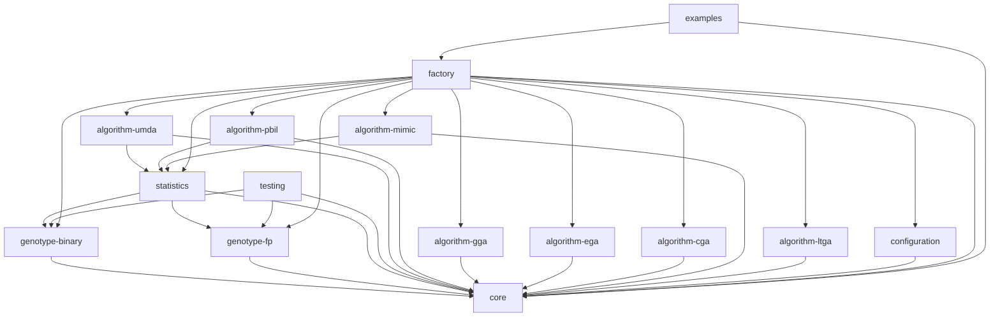

# Estimation of Distribution Algorithms Framework (EDAF)

Estimation of distribution algorithms (EDAs), sometimes called probabilistic 
model-building genetic algorithms (PMBGAs), are stochastic optimization methods 
that guide the search for the optimum by building and sampling explicit probabilistic 
models of promising candidate solutions. Optimization is viewed as a series of
incremental updates of a probabilistic model, starting with the model
encoding the uniform distribution over admissible solutions and ending with
the model that generates only the global optima.

This is a completely redesigned and rebuilt Java framework for Estimation of Distribution Algorithms (EDAs), based on the original work by Karlo Knezevic.

## Architecture

The framework is designed with a modular and extensible architecture. It is built with Java 17+ and Maven.
The main components are defined by interfaces in the `core` module, and the implementations are provided in separate modules.

### Modules

Here is a diagram of the module dependencies:



*   `core`: Core interfaces and classes.
*   `genotype-binary`: Binary genotype implementation.
*   `genotype-fp`: Floating-point genotype implementation.
*   `algorithm-umda`: UMDA algorithm implementation.
*   `algorithm-pbil`: PBIL algorithm implementation.
*   `algorithm-gga`: Generational Genetic Algorithm implementation.
*   `statistics`: Statistics implementations.
*   `configuration`: Configuration loading from YAML files.
*   `testing`: Testing utilities.
*   `examples`: Usage examples.

## How to Build

The project is built with Maven. To build the project, run the following command from the root directory:

```
mvn clean install
```

This will compile all the modules and create the JAR files in the `target` directory of each module.

## How to Run

The `examples` module produces an executable JAR file with all the necessary dependencies.
You can run the framework from the command line using this JAR.

First, build the project using `mvn clean install`. This will create the executable JAR in the `examples/target` directory.
The JAR will be named `examples-2.0.0-SNAPSHOT-jar-with-dependencies.jar`.

To run an experiment, you need to provide a path to a configuration file in YAML format.
The path to the configuration file should be relative to your current directory.
There are several example configuration files in the `examples/config` directory.

For example, to run the `cga-max-ones` example from the root directory of the project, use the following command:
```
java -jar examples/target/examples-2.0.0-SNAPSHOT-jar-with-dependencies.jar examples/config/cga-max-ones.yaml
```

## Extending the Framework

You can extend the framework by adding your own custom problems. Here are the steps to do that:

1.  **Create a new problem class.** Your class must implement the `hr.fer.zemris.edaf.core.Problem` interface.
    This interface has a single method, `evaluate(Individual individual)`, which you need to implement.
    For example, you could create a `MyProblem.java` file in your own package.

    ```java
    package com.mycompany.myproject;

    import hr.fer.zemris.edaf.core.Problem;
    import hr.fer.zemris.edaf.core.Individual;

    public class MyProblem implements Problem {
        @Override
        public void evaluate(Individual individual) {
            // Your evaluation logic here
        }
    }
    ```

2.  **Update the configuration file.** In your YAML configuration file, you need to specify the fully qualified name of your new problem class.

    ```yaml
    problem:
        name: com.mycompany.myproject.MyProblem
        # other problem parameters...
    ```

3.  **Build and run.** Rebuild the project with `mvn clean install` to include your new class.
    Then, you can run the framework with your new configuration file.