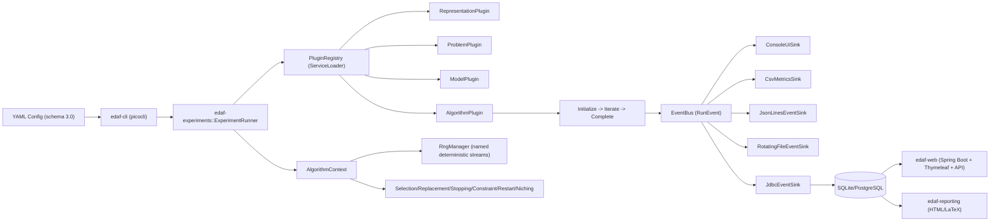

# Estimation of Distribution Algorithms Framework (EDAF)


[](LICENSE)

**EDAF** is a modular Java 21 framework for Estimation of Distribution Algorithms (EDAs), including discrete, continuous, permutation, and mixed-variable optimization pipelines. The framework is designed for research and engineering workflows where reproducibility, observability, and composability are first-class concerns.

**Karlo Knezevic** (2013). *Evolucijski algoritmi temeljeni na vjerojatnosnim razdiobama* (Croatian). *Master thesis, Nr. 540*, Faculty of Electrical Engineering and Computing, University of Zagreb. [Google Scholar](https://scholar.google.hr/citations?view_op=view_citation&hl=en&user=vrxkfe0AAAAJ&citation_for_view=vrxkfe0AAAAJ:UeHWp8X0CEIC)

## Table of Contents

- [Architecture](#architecture)
- [Module Layout](#module-layout)
- [Supported Components](#supported-components)
- [Getting Started](#getting-started)
- [CLI Commands](#cli-commands)
- [Configuration](#configuration)
- [Operators and Policies](#operators-and-policies)
- [Logging and Observability](#logging-and-observability)
- [Persistence and Database](#persistence-and-database)
- [Web Dashboard and API](#web-dashboard-and-api)
- [Docker Usage](#docker-usage)
- [Extending the Framework](#extending-the-framework)
- [Testing and Quality](#testing-and-quality)
- [Documentation Map](#documentation-map)
- [License](#license)

## Architecture

EDAF v3 is plugin-driven and strongly typed. A run is assembled from representation, problem, model, algorithm, and runtime policies. Event sinks provide console UX, files, JSONL, DB persistence, reporting, and web querying without changing algorithm code.



### Core Design Principles

- Determinism by default: one master seed, component-scoped RNG streams, checkpointed RNG state.
- Separation of concerns: algorithm logic is decoupled from persistence and presentation.
- Plugin extensibility: new representation/problem/model/algorithm via ServiceLoader.
- Research-friendly traces: per-iteration metrics, diagnostics, raw event payloads.
- Operational ergonomics: CLI progress, filtering APIs, run dashboards, report generation.

## Module Layout

| Module | Responsibility |
| --- | --- |
| `edaf-core` | Core contracts (`Algorithm`, `Model`, `Problem`, `Representation`), policies, RNG, events, config model/validation |
| `edaf-representations` | Genotype domains and domain repair/validation implementations |
| `edaf-models-discrete` | Discrete probabilistic models |
| `edaf-models-continuous` | Continuous probabilistic models and strategy-model scaffolds |
| `edaf-models-permutation` | Permutation models |
| `edaf-problems` | Built-in benchmark/objective implementations |
| `edaf-algorithms` | Algorithm drivers and algorithm plugins |
| `edaf-experiments` | Runtime orchestration, batch execution, checkpoint/resume |
| `edaf-persistence` | Event sinks, JDBC schema/bootstrap, read query repository |
| `edaf-reporting` | HTML/LaTeX report generation |
| `edaf-web` | Web UI + REST API over persisted runs |
| `edaf-cli` | User-facing CLI entrypoint and console UX |

## Supported Components

### Algorithms (`./edaf list algorithms`)

Current registry includes UMDA, Gaussian EDA, EHM-EDA, PBIL, cGA, BMDA, MIMIC, BOA, EBNA, GMM-EDA, KDE-EDA, Copula-EDA, sNES, xNES, CMA-ES, Plackett-Luce EDA, Mallows EDA, and MO-EDA skeleton.

Implementation status:

- Production vertical slices:
  - `umda` (discrete)
  - `gaussian-eda` (continuous, diagonal Gaussian pipeline)
  - `ehm-eda` (permutation)
- Working baselines/scaffolds (explicit TODO markers in source):
  - `pbil`, `cga`, `bmda`, `mimic`, `boa`, `ebna`
  - `gmm-eda`, `kde-eda`, `copula-eda`
  - `snes`, `xnes`, `cma-es`
  - `plackett-luce-eda`, `mallows-eda`
  - `mo-eda-skeleton`

### Models (`./edaf list models`)

- Discrete: `umda-bernoulli`, `pbil-frequency`, `cga-frequency`, `bmda`, `mimic-chow-liu`, `boa-ebna`
- Continuous: `gaussian-diag`, `gaussian-full`, `gmm`, `kde`, `copula-baseline`, `snes`, `xnes`, `cma-es`
- Permutation: `ehm`, `plackett-luce`, `mallows`

### Representations

- `bitstring`
- `int-vector`
- `categorical-vector`
- `mixed-discrete-vector`
- `real-vector`
- `mixed-real-discrete-vector`
- `permutation-vector`
- `variable-length-vector`

### Problems (`./edaf list problems`)

- `onemax`
- `sphere`
- `rosenbrock`
- `rastrigin`
- `small-tsp`
- `mixed-toy`

## Getting Started

### Prerequisites

- Java 21+
- Maven 3.9+

### Build and Test

```bash
mvn -q clean test
```

### Build CLI Fat Jar

```bash
mvn -q -pl edaf-cli -am package
```

### Run First Experiment

```bash
./edaf run -c configs/umda-onemax-v3.yml
```

The wrapper script automatically builds `edaf-cli` if needed.

## CLI Commands

Top-level help:

```bash
./edaf --help
```

### 1) Run

```bash
./edaf run -c configs/umda-onemax-v3.yml
./edaf run -c configs/gaussian-sphere-v3.yml --verbosity verbose
```

### 2) Batch

```bash
./edaf batch -c configs/batch-v3.yml
```

`configs/batch-v3.yml` contains a list of experiment config paths.

### 3) Resume from Checkpoint

```bash
./edaf resume --checkpoint results/checkpoints/gaussian-sphere-v3-iter-50.ckpt.yaml
```

### 4) Generate Reports from DB

```bash
./edaf report --run-id umda-onemax-v3 --out reports --db-url jdbc:sqlite:edaf-v3.db
./edaf report --run-id umda-onemax-v3 --out reports --formats html,latex
```

### 5) Validate Config

```bash
./edaf config validate configs/umda-onemax-v3.yml
./edaf config validate configs/batch-v3.yml
```

### 6) List Discoverable Plugins

```bash
./edaf list algorithms
./edaf list models
./edaf list problems
```

## Configuration

EDAF uses strict YAML with `schema: "3.0"`.

Top-level sections:

- `run`
- `representation`
- `problem`
- `algorithm`
- `model`
- `selection`
- `replacement`
- `stopping`
- `constraints`
- `localSearch`
- `restart`
- `niching`
- `observability`
- `persistence`
- `reporting`
- `web`
- `logging`

### Minimal Runnable Example

```yaml
schema: "3.0"

run:
  id: demo-umda
  masterSeed: 12345
  deterministicStreams: true
  checkpointEveryIterations: 0

representation:
  type: bitstring
  length: 64

problem:
  type: onemax

algorithm:
  type: umda
  populationSize: 200
  selectionRatio: 0.4

model:
  type: umda-bernoulli
  smoothing: 0.01

selection:
  type: truncation

replacement:
  type: elitist

stopping:
  type: max-iterations
  maxIterations: 120

constraints:
  type: identity

localSearch:
  type: none

restart:
  type: none

niching:
  type: none

observability:
  metricsEveryIterations: 10
  emitModelDiagnostics: true

persistence:
  enabled: true
  sinks: [console, csv, jsonl, db]
  outputDirectory: ./results
  database:
    enabled: true
    url: jdbc:sqlite:edaf-v3.db
    user: ""
    password: ""

reporting:
  enabled: true
  formats: [html]
  outputDirectory: ./reports

web:
  enabled: false
  port: 7070
  pollSeconds: 3

logging:
  modes: [console, jsonl, file, db]
  verbosity: normal
  jsonlFile: ./results/demo-umda-events.jsonl
  logFile: ./edaf-v3.log
```

Compatibility rules are validated semantically (for example, permutation representation cannot use Gaussian continuous models).

## Operators and Policies

EDAF v3 separates probabilistic modeling from runtime policies. Instead of hard-coding operators inside each algorithm, the same algorithm can be composed with different policies through config.

### Selection Policies

| Type | Description | Typical use |
| --- | --- | --- |
| `truncation` | Select top-ranked prefix of population | EDA baselines with model fitting over elites |
| `tournament` | Tournament-based stochastic selection | Robust alternative when fitness has noise |

Config section:

```yaml
selection:
  type: truncation
```

### Replacement Policies

| Type | Description |
| --- | --- |
| `elitist` | Keep best individuals across generations |
| `generational` | Alias to generational-style replacement (implemented by policy adapter) |

Config section:

```yaml
replacement:
  type: elitist
```

### Constraint Handling

| Type | Description |
| --- | --- |
| `identity` | Assume sampled individuals are valid |
| `repair` | Apply representation/problem repair logic |
| `rejection` | Reject invalid samples and resample |
| `penalty` | Keep invalid samples and penalize fitness |

Config section:

```yaml
constraints:
  type: repair
```

### Additional Runtime Policies

| Policy area | Built-in types |
| --- | --- |
| Restart | `none`, `stagnation` |
| Niching | `none`, `fitness-sharing` |
| Local search | `none` (baseline no-op, extension point active) |

## Logging and Observability

Event sinks can be enabled via `logging.modes` and `persistence.sinks`.

Supported sink names:

- `console`
- `csv`
- `jsonl`
- `file`
- `db`

Verbosity levels:

- `quiet`
- `normal`
- `verbose`
- `debug`

Standard event types:

- `run_started`
- `iteration_completed`
- `checkpoint_saved`
- `run_resumed`
- `run_completed`
- `run_failed`

Typical generated artifacts:

- `results/<run-id>.csv`
- `results/<run-id>.jsonl`
- `edaf-v3.log`
- `results/checkpoints/<run-id>-iter-<k>.ckpt.yaml`
- `reports/report-<run-id>.html` / `.tex`

## Persistence and Database

The JDBC layer persists both normalized metadata and searchable flattened configuration params.

Main tables:

- `experiments`
- `experiment_params`
- `runs`
- `run_objectives`
- `iterations`
- `checkpoints`
- `events`

Key behaviors:

- Canonical `config_json` is hashed (`config_hash`) and used as stable `experiment_id`.
- Nested YAML is flattened into path rows (e.g. `problem.genotype.maxDepth`, `problem.criteria[0]`).
- Legacy schema is auto-detected and reset only when truly legacy (no unnecessary wipe).

For full schema and query details, see [`docs/database-schema.md`](docs/database-schema.md).

## Web Dashboard and API

Run web app locally:
From a terminal opened at `/Users/karloknezevic/Desktop/EDAF`:

```bash
EDAF_DB_URL="jdbc:sqlite:$(pwd)/edaf-v3.db" mvn -q -f edaf-web/pom.xml spring-boot:run
```

Stop the server with `Ctrl+C` in that terminal.

Open:

- [http://localhost:7070](http://localhost:7070)

REST API:

- `GET /api/runs`
- `GET /api/runs/{runId}`
- `GET /api/runs/{runId}/iterations`
- `GET /api/runs/{runId}/events`
- `GET /api/runs/{runId}/checkpoints`
- `GET /api/runs/{runId}/params`
- `GET /api/facets`

`/api/runs` supports search/filter/sort/pagination (`q`, `algorithm`, `model`, `problem`, `status`, `from`, `to`, `minBest`, `maxBest`, `page`, `size`, `sortBy`, `sortDir`).

## Docker Usage

### Build and Start Full Stack

```bash
docker compose up --build
```

Services:

- `db` (PostgreSQL)
- `web` (dashboard on port `7070`)
- `runner` (executes a DB-enabled experiment config)

Default runner config used by compose:

- `configs/docker/umda-onemax-postgres-v3.yml`

### Run in Detached Mode

```bash
docker compose up -d --build
```

### Check Status and Logs

```bash
docker compose ps
docker compose logs -f web
docker compose logs -f runner
docker compose logs -f db
```

### Stop / Shutdown

```bash
docker compose stop
docker compose down
```

### Remove Volumes (delete DB state)

```bash
docker compose down -v
```

## Extending the Framework

You can add new components without touching orchestration code.

### Add a New Problem / Model / Algorithm / Representation

1. Implement the corresponding plugin interface in the appropriate module:
   - `ProblemPlugin<G>`
   - `ModelPlugin<G>`
   - `AlgorithmPlugin<G>`
   - `RepresentationPlugin<G>`
2. Implement `type()`, `description()`, and `create(...)`.
3. Register class in `META-INF/services/<PluginInterfaceFQCN>`.
4. Build and verify discovery with CLI list commands.
5. Use new `type` in YAML.

Full step-by-step examples are in [`docs/extending-the-framework.md`](docs/extending-the-framework.md).

## Testing and Quality

Run all tests:

```bash
mvn -q clean test
```

Targeted suites:

```bash
mvn -pl edaf-experiments -am test
mvn -pl edaf-persistence,edaf-web,edaf-reporting -am test
```

Coverage includes:

- unit tests for models and config loader
- integration slices for discrete/continuous/permutation pipelines
- property-based tests (e.g., permutation representation validity)
- persistence schema/reset and query filtering tests

## Documentation Map

- [docs/index.md](docs/index.md) - full map
- [docs/getting-started.md](docs/getting-started.md) - practical first-run walkthrough
- [docs/architecture.md](docs/architecture.md) - module and runtime design
- [docs/configuration.md](docs/configuration.md) - complete config reference
- [docs/algorithms.md](docs/algorithms.md) - algorithm-level details and status
- [docs/representations.md](docs/representations.md) - representation contracts and parameters
- [docs/logging-and-observability.md](docs/logging-and-observability.md) - events, sinks, metrics
- [docs/database-schema.md](docs/database-schema.md) - DB schema, relations, indexes, query model
- [docs/web-dashboard.md](docs/web-dashboard.md) - UI/API behavior and filtering
- [docs/cli-reference.md](docs/cli-reference.md) - exhaustive command reference
- [docs/docker.md](docs/docker.md) - containerized workflows
- [docs/extending-the-framework.md](docs/extending-the-framework.md) - plugin authoring guide
- [docs/usage-guide.md](docs/usage-guide.md) - command cookbook and recipes

## License

EDAF (Estimation of Distribution Algorithms Framework)  
Copyright (C) 2026 Dr. Karlo Knezevic

Licensed under GNU GPL v3. See [LICENSE](LICENSE).
