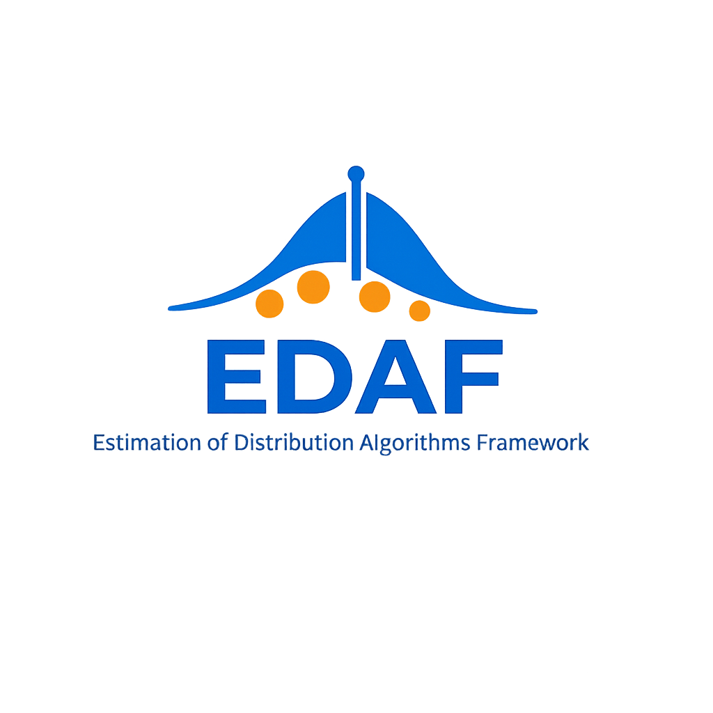
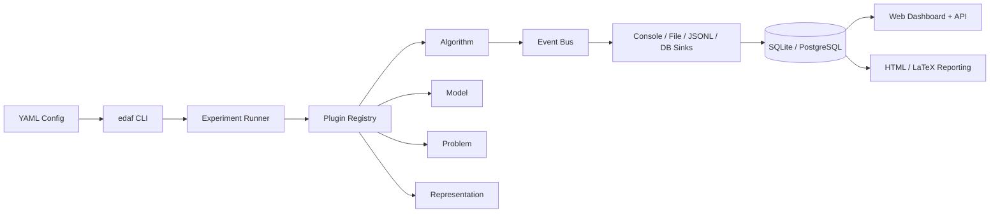
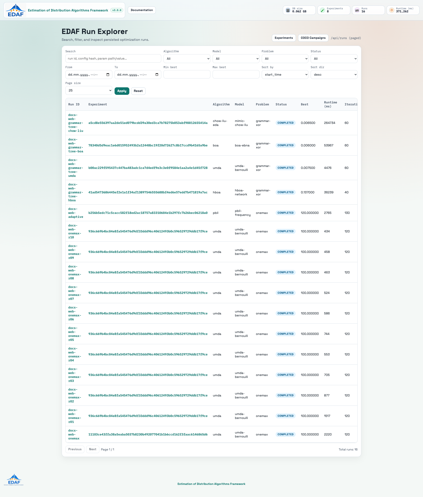
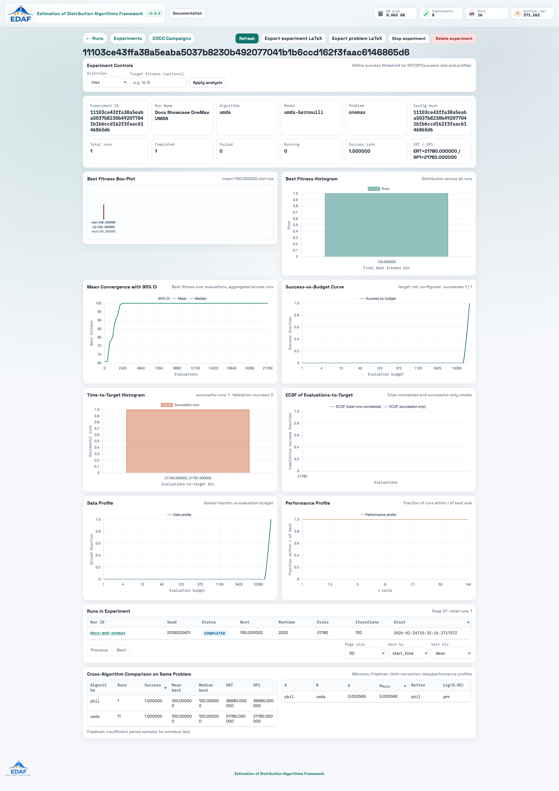
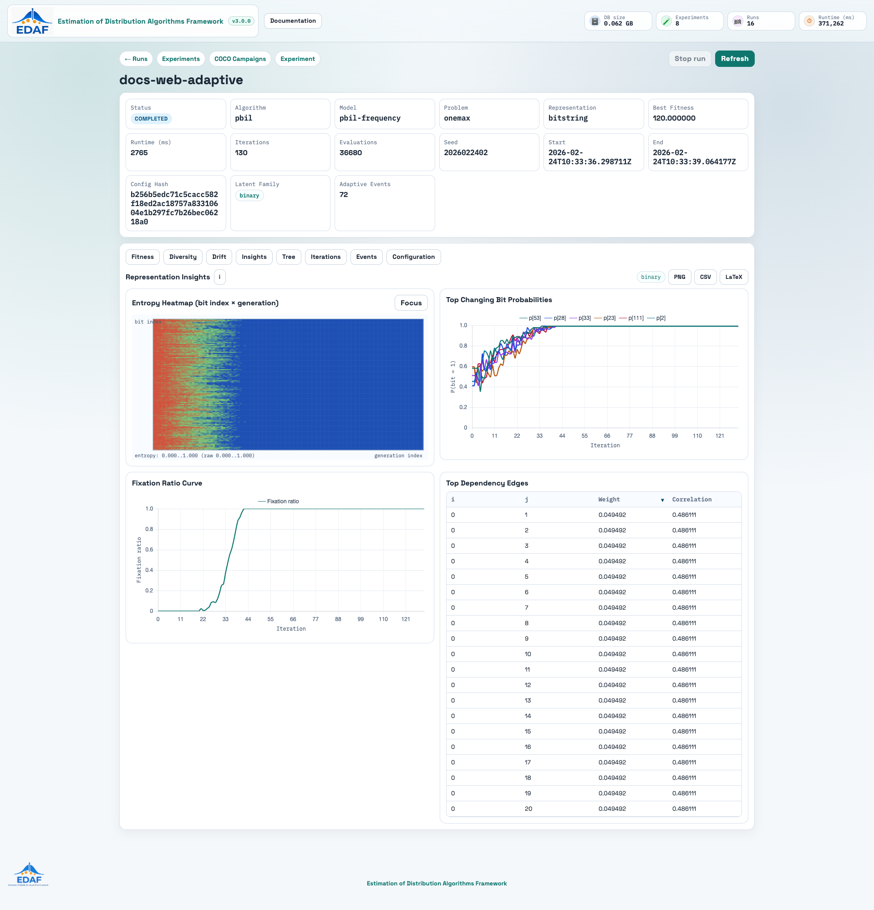
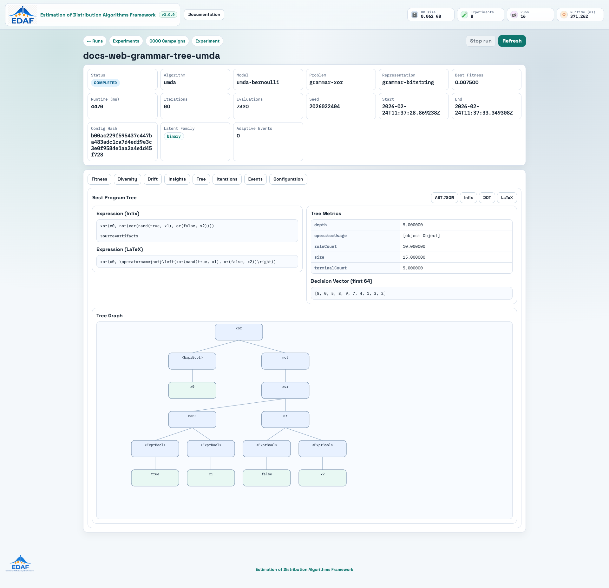

<p align="center">
  
</p>

# Estimation of Distribution Algorithms Framework (EDAF)


[](LICENSE)

EDAF is a research-grade Java framework for **Estimation of Distribution Algorithms (EDAs)** and adjacent evolutionary optimization workflows.
It is designed for teams that need reproducibility, deep telemetry, algorithmic extensibility, and publishable benchmarking outputs.

Documentation portal: [https://edaf.readthedocs.io/](https://edaf.readthedocs.io/)  
Repository docs index: [docs/index.md](docs/index.md)

## Why EDAF

- Strongly typed, modular architecture across algorithms, models, representations, problems, execution, persistence, reporting, and web.
- Reproducible by design: deterministic seed handling, component-level RNG streams, checkpoint/resume.
- Research observability: latent model insights, drift/diversity metrics, adaptive-event timeline, experiment-level analytics.
- Production-grade operational tooling: CLI, structured logging, DB-backed run explorer, static reports, Docker stack.
- Extensible plugin system (ServiceLoader) for custom algorithms, models, representations, and problems.

## Architecture At A Glance


```mermaid
graph LR
    CFG["YAML Config"] --> CLI["edaf CLI"]
    CLI --> RUNNER["Experiment Runner"]
    RUNNER --> REG["Plugin Registry"]

    REG --> ALG["Algorithm"]
    REG --> MODEL["Model"]
    REG --> PROB["Problem"]
    REG --> REP["Representation"]

    ALG --> BUS["Event Bus"]
    BUS --> SINKS["Console / File / JSONL / DB Sinks"]
    SINKS --> DB[("SQLite / PostgreSQL")]

    DB --> WEB["Web Dashboard + API"]
    DB --> REPORT["HTML / LaTeX Reporting"]
```

## Supported Optimization Scope

### Representations

- BitString
- IntVector (bounded)
- CategoricalVector
- MixedDiscreteVector
- RealVector (bounded/unbounded)
- MixedRealDiscreteVector
- PermutationVector
- VariableLengthVector
- GrammarBitString (grammar-based GP)

### Models

- Discrete: Bernoulli/frequency vectors, dependency-tree and Bayesian-network families
- Continuous: diagonal and full Gaussian, mixture/KDE/copula/flow families
- Permutation: edge histogram and ranking-based models
- Strategy-model hybrids: NES and CMA-style updates

### Algorithm Families

- **Discrete EDAs:** UMDA, PBIL, cGA, BMDA, MIMIC, BOA, hBOA, EBNA, Chow-Liu / dependency-tree variants, factorized variants
- **Continuous EDAs/strategies:** Gaussian EDA, GMM-EDA, KDE-EDA, Copula-EDA, Flow-EDA, CEM, IGO-style drivers, sNES, xNES, CMA-ES
- **Permutation EDAs:** EHM/EHBSA-style, Mallows and Plackett-Luce variants
- **Advanced lines:** noisy/dynamic aliases, multi-objective skeletons, adaptive runs with latent-knowledge triggers

### Built-in Problem Coverage

- Continuous: Sphere, Rosenbrock, Rastrigin, CEC suite adapters, COCO/BBOB integration
- Discrete/combinatorial: OneMax, Knapsack, MAX-SAT, TSP/TSPLIB, disjunct matrix family (DM/RM/ADM)
- Multi-objective: ZDT and DTLZ baseline suites
- Symbolic/grammar: boolean tasks, regression from CSV, multiclass classification from CSV
- Crypto/boolean-function optimization suite

## Quick Start

### 1) Build and test

```bash
mvn -q clean test
```

### 2) Run a first experiment

```bash
./edaf run -c configs/docs/web-screenshot-onemax.yml
```

### 3) Start local web dashboard

```bash
./scripts/run-web-local.sh
```

Open [http://localhost:7070](http://localhost:7070).

### 4) Generate run report

```bash
./edaf report --run-id <run-id> --out reports --db-url jdbc:sqlite:edaf.db
```

## Web Dashboard Preview

### Run explorer



### Experiment analytics



### Representation insights panel



### Grammar/tree visualization



## Research-Grade Analytics Out Of The Box

EDAF persists both run-level and experiment-level analytics, including:

- convergence summaries with confidence intervals
- success rate and success-vs-budget curves
- time-to-target histograms
- final-fitness box plots and ECDF
- diversity and drift diagnostics
- latent model insights (entropy/fixation/dependencies, permutation structure, real-valued uncertainty)
- adaptive-event timeline (what triggered, what action was applied)
- statistical comparison blocks (Wilcoxon/Friedman/Holm where configured)

## Grammar-Based Symbolic Optimization

EDAF includes grammar-based symbolic regression/classification with:

- `grammar.mode: auto` and `grammar.mode: custom` (BNF)
- deterministic encoding from derivation decisions
- ephemeral random constants (ERC) with reproducible sampling
- tree rendering in web UI (AST + infix + DOT + LaTeX export)
- config suites in `configs/grammar_gp_suite/`

Guide: [docs/foundations/grammar-based-gp.md](docs/foundations/grammar-based-gp.md)

## Operability and Reproducibility

- JSONL/CSV/file/DB sinks with structured payloads
- asynchronous persistence path for high-throughput runs
- cooperative stop controls for run/experiment from UI/API
- batch orchestration and campaign workflows
- deterministic checkpoint/resume
- Docker-based local stack (runner + DB + web)

## Use EDAF As A Dependency

```xml
<dependencyManagement>
  <dependencies>
    <dependency>
      <groupId>io.github.karloknezevic</groupId>
      <artifactId>edaf-parent</artifactId>
      <version>${edaf.version}</version>
      <type>pom</type>
      <scope>import</scope>
    </dependency>
  </dependencies>
</dependencyManagement>

<dependencies>
  <dependency>
    <groupId>io.github.karloknezevic</groupId>
    <artifactId>edaf-core</artifactId>
  </dependency>
  <dependency>
    <groupId>io.github.karloknezevic</groupId>
    <artifactId>edaf-algorithms</artifactId>
  </dependency>
  <dependency>
    <groupId>io.github.karloknezevic</groupId>
    <artifactId>edaf-problems</artifactId>
  </dependency>
</dependencies>
```

Integration guide: [docs/guides/using-edaf-as-package.md](docs/guides/using-edaf-as-package.md)

## Academic Positioning and References

EDAF is built for reproducible optimization research pipelines and comparative studies.
It supports benchmark protocol workflows (COCO/BBOB and suite-style campaigns), run replication, and exportable report artifacts suitable for publications.

Selected references:

1. Larrañaga, P., & Lozano, J. A. (Eds.). *Estimation of Distribution Algorithms*. Springer.
2. Mühlenbein, H., & Paass, G. *From recombination of genes to the estimation of distributions I.*
3. Mühlenbein, H., Bendisch, J., & Voigt, H. M. *From recombination of genes to the estimation of distributions II.*
4. Pelikan, M., Goldberg, D. E., & Cantú-Paz, E. *BOA: the Bayesian optimization algorithm.*

Full bibliography: [docs/references/bibliography.md](docs/references/bibliography.md)

## Documentation Map

### Core and architecture

- [docs/index.md](docs/index.md)
- [docs/foundations/architecture.md](docs/foundations/architecture.md)
- [docs/foundations/configuration.md](docs/foundations/configuration.md)
- [docs/foundations/cli-reference.md](docs/foundations/cli-reference.md)
- [docs/foundations/algorithms.md](docs/foundations/algorithms.md)
- [docs/foundations/representations.md](docs/foundations/representations.md)
- [docs/foundations/extending-the-framework.md](docs/foundations/extending-the-framework.md)

### Runtime and analytics

- [docs/runtime/web-dashboard.md](docs/runtime/web-dashboard.md)
- [docs/runtime/database-schema.md](docs/runtime/database-schema.md)
- [docs/runtime/latent-insights.md](docs/runtime/latent-insights.md)
- [docs/runtime/logging-and-observability.md](docs/runtime/logging-and-observability.md)
- [docs/runtime/metrics-and-results.md](docs/runtime/metrics-and-results.md)

### Benchmarks and suites

- [docs/benchmarks/problem-suites.md](docs/benchmarks/problem-suites.md)
- [docs/benchmarks/coco-integration.md](docs/benchmarks/coco-integration.md)
- [docs/benchmarks/disjunct-matrix-problems.md](docs/benchmarks/disjunct-matrix-problems.md)
- [docs/benchmarks/adm-paper-suite.md](docs/benchmarks/adm-paper-suite.md)
- [docs/benchmarks/crypto-boolean-problems.md](docs/benchmarks/crypto-boolean-problems.md)
- [docs/benchmarks/benchmark-comparisons.md](docs/benchmarks/benchmark-comparisons.md)
- [docs/benchmarks/complexity-and-performance.md](docs/benchmarks/complexity-and-performance.md)

### Engineering and release

- [docs/guides/getting-started.md](docs/guides/getting-started.md)
- [docs/guides/usage-guide.md](docs/guides/usage-guide.md)
- [docs/guides/docker.md](docs/guides/docker.md)
- [docs/engineering/testing-and-release.md](docs/engineering/testing-and-release.md)
- [docs/engineering/release-and-publishing.md](docs/engineering/release-and-publishing.md)
- [docs/engineering/improvements.md](docs/engineering/improvements.md)
- [docs/release-notes/index.md](docs/release-notes/index.md)

### API docs

- [docs/api/javadoc-api.md](docs/api/javadoc-api.md)

## Author

**Karlo Knezevic** (2013). *Evolucijski algoritmi temeljeni na vjerojatnosnim razdiobama* (Croatian).  
*Master thesis, Nr. 540*, Faculty of Electrical Engineering and Computing, University of Zagreb.  
[Google Scholar profile](https://scholar.google.hr/citations?view_op=view_citation&hl=en&user=vrxkfe0AAAAJ&citation_for_view=vrxkfe0AAAAJ:UeHWp8X0CEIC)

## License

This project is licensed under [Apache License 2.0](LICENSE).
