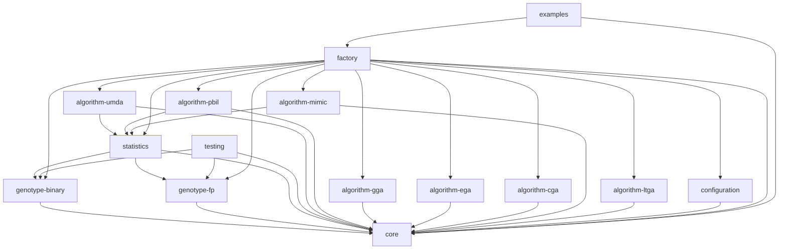

# Architecture

The framework is designed with a modular and extensible architecture. It is built with Java 17+ and Maven.
The main components are defined by interfaces in the `core` module, and the implementations are provided in separate modules.

## Module Dependencies

Here is a diagram of the module dependencies:

## Design Patterns

The framework makes use of several design patterns to achieve its modularity and extensibility.

### Factory Pattern

The `factory` module is the heart of the framework's component creation. It uses a combination of the **Abstract Factory**, **Strategy**, and **Facade** patterns.

*   **`ComponentFactory` (Facade):** The `ComponentFactory` interface and its `DefaultComponentFactory` implementation act as a Facade. It provides a simple interface for creating all the necessary components of an experiment, hiding the complexity of the underlying factory implementations.

*   **`AlgorithmFactory` (Abstract Factory):** The `AlgorithmFactory` is an Abstract Factory that defines the interface for creating a family of related objects: an `Algorithm`, a `Crossover` operator, and a `Mutation` operator. Each concrete algorithm (e.g., `gGA`, `eGA`, `UMDA`) has its own concrete factory that implements this interface.

*   **`GenotypeFactory` and `SelectionFactory` (Strategy):** The `GenotypeFactory` and `SelectionFactory` use the Strategy pattern. Each specific genotype (binary, floating-point, integer) and selection method (tournament, roulette wheel) has its own factory class that implements a common interface. A provider class (`GenotypeFactoryProvider`, `SelectionFactoryProvider`) is used to select the appropriate strategy at runtime based on the configuration.

This design makes it easy to add new algorithms, genotypes, and selection methods without modifying the core framework.
