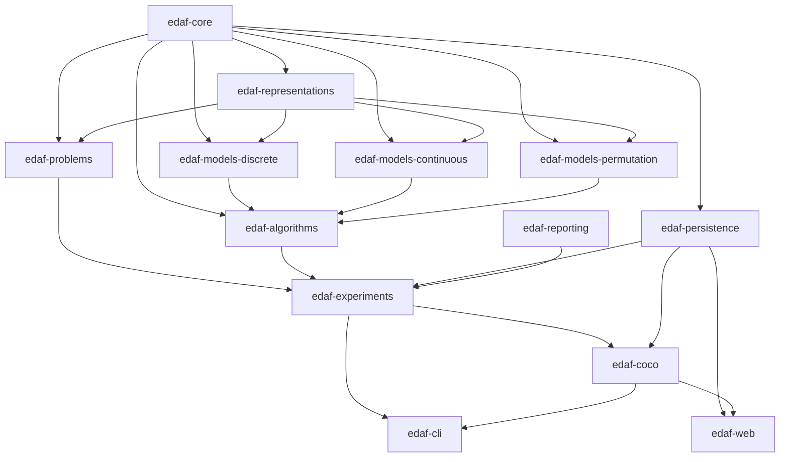
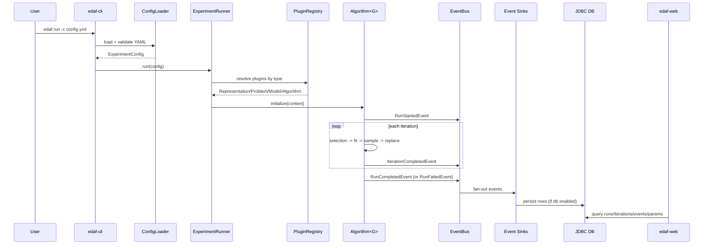

# Architecture

EDAF v3 is a modular, plugin-driven framework where configuration resolves runtime components and execution is routed through a typed event bus.

## 1) Module Dependency View

## 2) Runtime Pipeline

## 3) Core Contracts

`edaf-core` defines the fundamental contracts:

- `Representation<G>`
- `Problem<G>`
- `Model<G>`
- `Algorithm<G>`
- `Individual<G>`, `Population<G>`
- `Fitness` (`ScalarFitness`, `VectorFitness`)
- runtime policies:
  - `SelectionPolicy<G>`
  - `ReplacementPolicy<G>`
  - `StoppingCondition<G>`
  - `ConstraintHandling<G>`
  - `LocalSearch<G>`
  - `RestartPolicy<G>`
  - `NichingPolicy<G>`

The algorithm execution context is immutable (`AlgorithmContext<G>`) and aggregates all runtime dependencies.

## 4) Template Method in Algorithm Base

`AbstractEdaAlgorithm<G>` provides the main lifecycle and defers strategy-specific selection size and optional iteration hooks.

High-level loop:

1. initialize random feasible population
2. select subset
3. fit model
4. sample offspring
5. enforce constraints + evaluate + optional local search
6. replace population
7. apply niching and restart policy
8. collect metrics and emit iteration event

This removes copy/paste across algorithm drivers while preserving extension points.

## 5) Plugin Architecture

Plugins are discovered using Java `ServiceLoader`.

Interfaces:

- `RepresentationPlugin<G>`
- `ProblemPlugin<G>`
- `ModelPlugin<G>`
- `AlgorithmPlugin<G>`

Registry behavior (`PluginRegistry`):

- case-insensitive type normalization
- map-backed lookup by `type()`
- explicit resolution errors for unknown types

Service registration files are located at:

- `edaf-representations/src/main/resources/META-INF/services/com.knezevic.edaf.v3.core.plugins.RepresentationPlugin`
- `edaf-problems/src/main/resources/META-INF/services/com.knezevic.edaf.v3.core.plugins.ProblemPlugin`
- `edaf-models-*/src/main/resources/META-INF/services/com.knezevic.edaf.v3.core.plugins.ModelPlugin`
- `edaf-algorithms/src/main/resources/META-INF/services/com.knezevic.edaf.v3.core.plugins.AlgorithmPlugin`

## 6) Deterministic RNG Topology

`RngManager` derives deterministic named streams from one master seed.

Examples of stream keys currently used by execution pipeline:

- `init`
- `selection`
- `model-fit`
- `model-sample`
- `constraint`
- `local-search`
- `niching`
- `restart`

`RngSnapshot` captures full stream state for checkpoint/resume.

## 7) Eventing and Observability

Event bus contracts are in `edaf-core/src/main/java/com/knezevic/edaf/v3/core/events`.

Event types:

- `run_started`
- `iteration_completed`
- `checkpoint_saved`
- `run_resumed`
- `run_completed`
- `run_failed`

Sinks:

- `ConsoleUiSink` (rich terminal UX)
- `CsvMetricsSink`
- `JsonLinesEventSink`
- `RotatingFileEventSink`
- `JdbcEventSink`

## 8) Persistence Read/Write Segregation

Write side:

- `JdbcEventSink` stores event stream + normalized run metadata + flattened config params.

Read side:

- `RunRepository` / `JdbcRunRepository` serve filterable query projections for web and reporting.

This split keeps write path append/update-oriented and read path query-focused.

## 9) Web Layer

`edaf-web` is a Spring Boot + Thymeleaf app that reads persistence data:

- MVC pages for run list/detail
- MVC pages for COCO campaign list/detail
- REST API for polling/filters/pagination
- REST API for COCO campaign filters/pagination
- no frontend build toolchain

## 10) Reporting Layer

`edaf-reporting` generates standalone reports from persisted run data:

- HTML report with embedded Chart.js visualizations
- LaTeX report source for paper pipelines

## 11) Architectural Boundaries Summary

- Algorithms do not know about DB/web/reporting.
- Persistence sinks consume events; they do not drive optimization.
- CLI/web/reporting are adapters over the same core contracts and persistence model.
- Plugin addition does not require changes in runner orchestration code.

## 12) Current Architecture Snapshot (Consolidated)

Date of this snapshot: 2026-02-19.

### Active Maven Reactor Modules

- `edaf-core`
- `edaf-representations`
- `edaf-models-discrete`
- `edaf-models-continuous`
- `edaf-models-permutation`
- `edaf-problems`
- `edaf-algorithms`
- `edaf-experiments`
- `edaf-coco`
- `edaf-persistence`
- `edaf-reporting`
- `edaf-web`
- `edaf-cli`

### What Is Production-Ready Today

- discrete vertical slice: UMDA + OneMax
- continuous vertical slice: Gaussian diagonal EDA + Sphere
- permutation vertical slice: EHM EDA + small TSP
- expanded problem suite adapters:
  - `cec2014`
  - `knapsack`
  - `maxsat` (DIMACS CNF)
  - `tsplib-tsp` (TSPLIB parser)
  - `zdt` / `dtlz` (multiobjective benchmark suites)
  - `nguyen-sr` symbolic regression (token-tree encoding)
- variable-length token pipeline: `tree-eda` + `token-categorical`
- deterministic replay via master seed + named streams + checkpoint snapshots
- DB-backed query model with search/filter/sort/pagination used by web/API/reporting

### What Is Scaffold-Oriented Today

- full dependency learning for BMDA/MIMIC/BOA/EBNA
- advanced continuous estimators (GMM/KDE/copula)
- full NES/CMA adaptation logic
- exact Mallows estimation/sampling
- fully operational multi-objective EDA pipeline

Scaffold status is explicit in plugin descriptions and model/algorithm source comments.

## 13) Target Evolution Path (Without Breaking Core Contracts)

The architectural target keeps the current module boundaries and contract surfaces stable while increasing statistical sophistication.

### Contract Stability Rules

The following contracts are treated as stable extension points:

- `Representation<G>`
- `Problem<G>`
- `Model<G>`
- `Algorithm<G>`
- runtime policy interfaces
- plugin interfaces and ServiceLoader registration model

### Layer-Wise Evolution Priorities

- Core:
  - richer stopping conditions (target fitness, stagnation windows, convergence thresholds)
  - standardized diagnostics naming and metric bundles
- Models:
  - discrete dependency structure learning promotion from scaffold to full implementations
  - true GMM/KDE/copula estimators in continuous family
  - complete natural-gradient / covariance adaptation pipelines for NES/CMA
  - stronger Mallows inference in permutation family
- Algorithms:
  - promote scaffolded ratio-based drivers to family-specific drivers when required
  - complete MO-EDA with Pareto archive + dominance ranking + MO replacement
- Experiments:
  - advanced sweep orchestration and grouped benchmark execution
- Persistence and Web:
  - preserve schema/query compatibility while adding richer analytical projections
- Reporting:
  - add multi-run aggregate and comparative statistical outputs

## 14) Extension Safety Rules

- Introduce new families through plugins, not runner branching.
- Any stochastic logic must use `RngStream` from `RngManager`.
- Persist enough diagnostics to enable post-hoc model analysis.
- Extend semantic config validation when introducing new compatibility constraints.
- Error messages must include config path plus corrective hint.

## 15) Promotion Checklist (Scaffold -> Stable)

Before marking any algorithm/model family as stable:

1. deterministic replay check with fixed seed
2. domain-valid sampling/property checks
3. benchmark integration regression
4. persistence + web + reporting compatibility validation
5. documentation sync (`README.md`, algorithms/configuration/metrics/web docs)

## Related Docs

- [Configuration Reference](./configuration.md)
- [Extending the Framework](./extending-the-framework.md)
