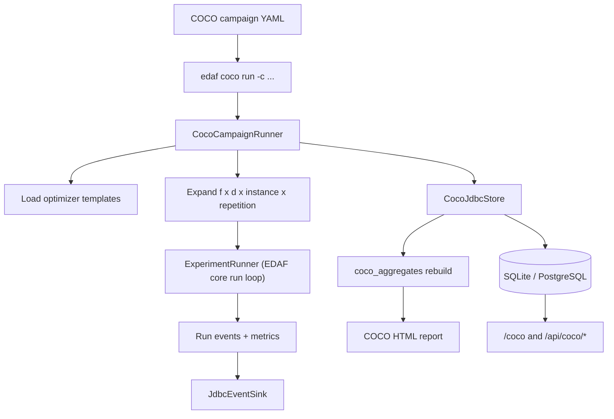
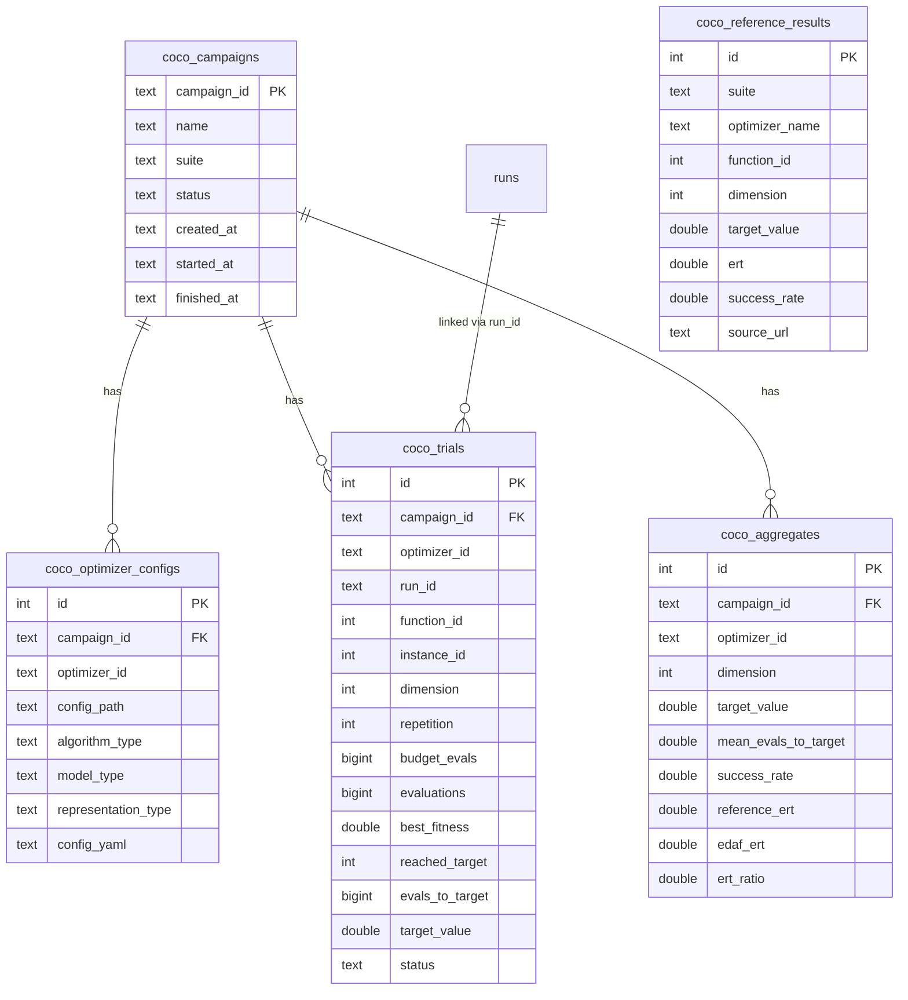

# COCO Integration Guide

This document explains how EDAF integrates with COCO/BBOB style benchmarking and how to run reproducible, comparable optimizer campaigns with database + HTML outputs.

## 1) What Is Integrated

EDAF now includes a dedicated `edaf-coco` module with:

- campaign config loader and semantic validation (`schema: "3.0-coco"`)
- campaign runner that expands one YAML into many reproducible runs
- COCO/BBOB problem adapter (`problem.type: coco-bbob`)
- campaign persistence tables in the primary DB
- aggregate metrics and reference comparison (`ERT ratio`)
- campaign-level HTML report generator
- web/API views for campaign list and campaign details

## 2) End-to-End Flow



## 3) Campaign Configuration

Primary files:

- `/Users/karloknezevic/Desktop/EDAF/configs/coco/bbob-smoke-v3.yml`
- `/Users/karloknezevic/Desktop/EDAF/configs/coco/bbob-campaign-v3.yml`
- `/Users/karloknezevic/Desktop/EDAF/configs/coco/bbob-publishable-v3.yml`
- `/Users/karloknezevic/Desktop/EDAF/configs/coco/bbob-publishable-v4.yml`

### Top-level shape

```yaml
schema: "3.0-coco"

campaign:
  id: coco-bbob-benchmark-v3
  name: COCO BBOB Benchmark Campaign (EDAF v3)
  suite: bbob
  functions: [1, 2, 3, 8, 15]
  dimensions: [2, 5, 10]
  instances: [1, 2]
  repetitions: 2
  maxEvaluationsMultiplier: 2000
  targetFitness: 1.0e-8
  databaseUrl: jdbc:sqlite:edaf-v3.db
  outputDirectory: ./results/coco
  reportDirectory: ./reports/coco
  referenceMode: best-online

optimizers:
  - id: gaussian-baseline
    config: optimizers/gaussian-baseline-v3.yml

  - id: gaussian-aggressive
    config: optimizers/gaussian-aggressive-v3.yml
```

### Field semantics

- `functions`, `dimensions`, `instances`, `repetitions`: define benchmark Cartesian product.
- `maxEvaluationsMultiplier`: per-trial budget = `multiplier * dimension`.
- `targetFitness`: success target used for success rate and ERT metrics.
- `referenceMode`:
  - `best-online`: compare against best reference ERT per function slice
  - `optimizer:<name>`: compare against one specific reference optimizer

## 4) Optimizer Templates

Templates are standard EDAF v3 experiment configs.

Files:

- `/Users/karloknezevic/Desktop/EDAF/configs/coco/optimizers/gaussian-baseline-v3.yml`
- `/Users/karloknezevic/Desktop/EDAF/configs/coco/optimizers/gaussian-aggressive-v3.yml`
- `/Users/karloknezevic/Desktop/EDAF/configs/coco/optimizers/cma-es-v3.yml`
- `/Users/karloknezevic/Desktop/EDAF/configs/coco/optimizers/cma-es-restart-v3.yml`

During campaign execution EDAF overrides:

- run id/name/seed
- problem section to `coco-bbob`
- representation length/bounds to campaign dimension
- CMA-ES population size auto-tuning (if `algorithm.autoPopulationSize=true`) using `max(8, 4 + floor(3 * ln(dimension)))`
- stopping max iterations from evaluation budget
- DB + file sink outputs into campaign-specific folders

## 5) Reference Data Import (for online comparison)

Reference extractor script:

- `/Users/karloknezevic/Desktop/EDAF/scripts/coco/build_reference_from_ppdata.py`

Fuller reference CSV (generated from official ppdata):

- `/Users/karloknezevic/Desktop/EDAF/configs/coco/reference/coco-reference-bbob-ppdata-2009-2023-f1-2-3-8-15-d2-5-10-20-t1e-7.csv`

Template CSV (manual small import):

- `/Users/karloknezevic/Desktop/EDAF/configs/coco/reference/coco-reference-template.csv`

Generate fuller reference CSV:

```bash
./scripts/coco/build_reference_from_ppdata.py \
  --functions 1,2,3,8,15 \
  --dimensions 2,5,10,20 \
  --target-label 1e-7 \
  --target-value 1e-7 \
  --out configs/coco/reference/coco-reference-bbob-ppdata-2009-2023-f1-2-3-8-15-d2-5-10-20-t1e-7.csv
```

Import command:

```bash
./edaf coco import-reference \
  --csv configs/coco/reference/coco-reference-bbob-ppdata-2009-2023-f1-2-3-8-15-d2-5-10-20-t1e-7.csv \
  --suite bbob \
  --source-url https://numbbo.github.io/ppdata-archive/ \
  --db-url jdbc:sqlite:edaf-v3.db
```

CSV columns:

- `optimizer_name,function_id,dimension,target_value,ert,success_rate`

## 6) CLI Commands

Run campaign:

```bash
./edaf coco run -c configs/coco/bbob-campaign-v3.yml
```

Quick smoke campaign:

```bash
./edaf coco run -c configs/coco/bbob-smoke-v3.yml
```

Larger publishable campaign:

```bash
./edaf coco run -c configs/coco/bbob-publishable-v4.yml
```

Re-generate campaign report from DB:

```bash
./edaf coco report \
  --campaign-id coco-bbob-benchmark-v3 \
  --out reports/coco \
  --db-url jdbc:sqlite:edaf-v3.db
```

## 7) Persistence Model for COCO

COCO persistence lives in the same DB and schema file:

- `/Users/karloknezevic/Desktop/EDAF/edaf-persistence/src/main/resources/db/migration/V1__init.sql`

Tables:

- `coco_campaigns`
- `coco_optimizer_configs`
- `coco_trials`
- `coco_reference_results`
- `coco_aggregates`

Relations:



## 8) Web UI and API for COCO

Pages:

- `/coco` campaign explorer (search/filter/sort/pagination)
- `/coco/{campaignId}` campaign detail with aggregate charts and trial filtering

API:

- `GET /api/coco/campaigns`
- `GET /api/coco/campaigns/{campaignId}`
- `GET /api/coco/campaigns/{campaignId}/optimizers`
- `GET /api/coco/campaigns/{campaignId}/aggregates`
- `GET /api/coco/campaigns/{campaignId}/trials`

## 9) Recommended Benchmarking Protocol

To produce fair, publication-ready comparisons:

1. Fix campaign dimensions/functions/instances and target.
2. Fix `masterSeed` policy and keep deterministic stream derivation enabled.
3. Use at least `repetitions >= 5` for stable ranking.
4. Import one trusted external reference source and keep `source_url` persisted.
5. Compare using:
   - success rate
   - ERT (EDAF and reference)
   - ERT ratio by dimension
6. Publish campaign HTML + DB snapshot for reproducibility.

## 10) Adding a New Optimizer to Campaigns

1. Add a standard v3 optimizer config file under `configs/coco/optimizers/`.
2. Ensure representation family is continuous-compatible for BBOB.
3. Add optimizer entry in campaign YAML.
4. Optionally add `algorithm.*` / `model.*` overrides in campaign optimizer block.
5. Run campaign and inspect `/coco/{campaignId}`.

## 11) Extending COCO Support in Code

Main extension points:

- BBOB objective implementation:
  - `/Users/karloknezevic/Desktop/EDAF/edaf-problems/src/main/java/com/knezevic/edaf/v3/problems/coco/BbobFunctions.java`
- Problem plugin registration:
  - `/Users/karloknezevic/Desktop/EDAF/edaf-problems/src/main/java/com/knezevic/edaf/v3/problems/plugins/continuous/CocoBbobProblemPlugin.java`
- Campaign orchestration:
  - `/Users/karloknezevic/Desktop/EDAF/edaf-coco/src/main/java/com/knezevic/edaf/v3/coco/runner/CocoCampaignRunner.java`
- Campaign persistence:
  - `/Users/karloknezevic/Desktop/EDAF/edaf-coco/src/main/java/com/knezevic/edaf/v3/coco/persistence/CocoJdbcStore.java`

## 12) Known Scope Boundaries

Current implementation focuses on BBOB-style continuous benchmarks and campaign orchestration in EDAF.

Not in scope yet:

- automatic online scraping/parsing of COCO official tables
- direct integration with full COCO C/Python tooling pipeline
- significance test automation (e.g., Wilcoxon/Friedman) in reports

These can be added incrementally without changing the existing campaign schema.
