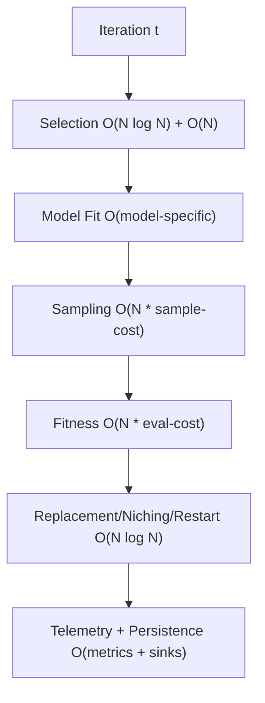
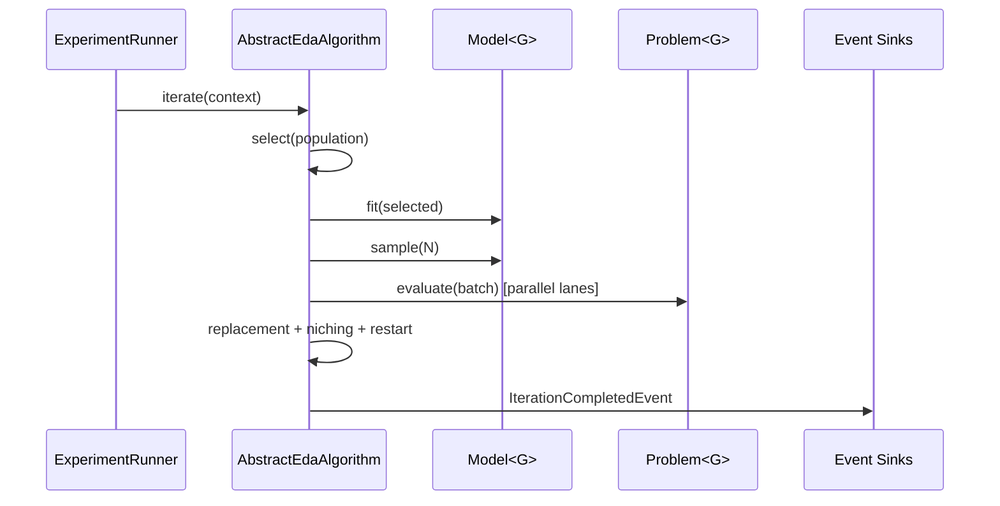
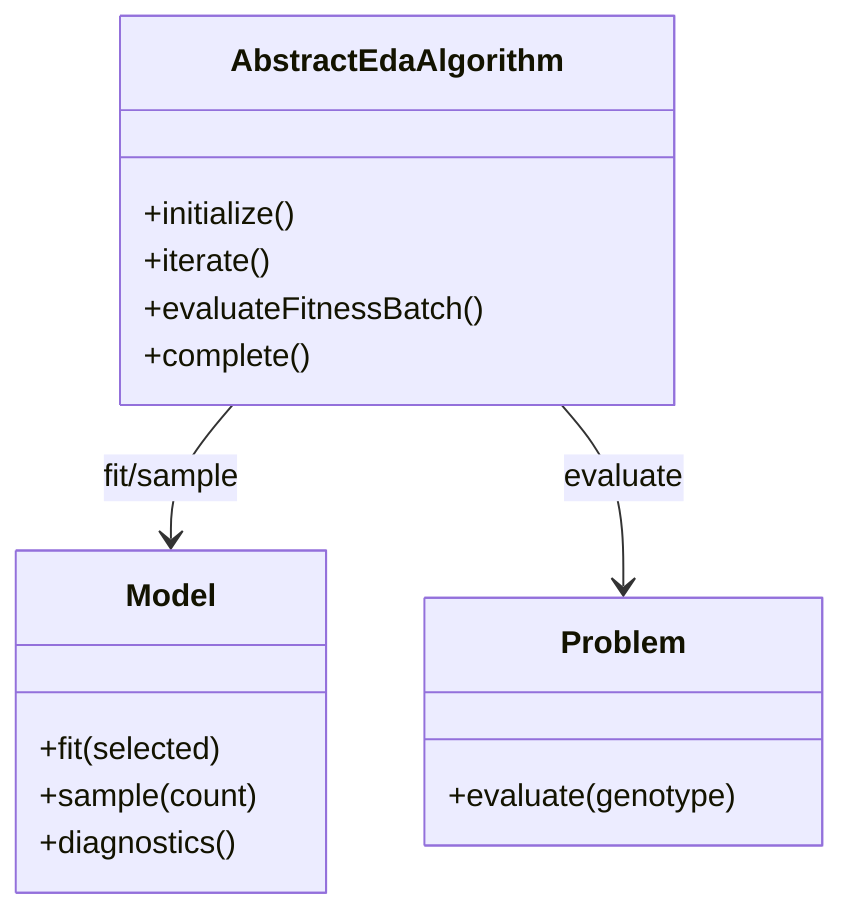
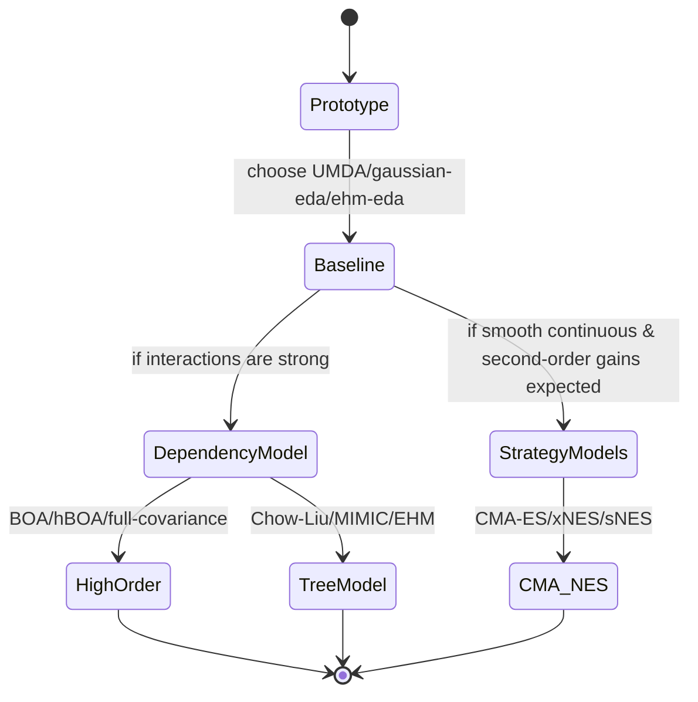

<p align="right"></p>

# Algorithm Complexity and Performance

This document gives a practical complexity map for EDAF algorithms and a reproducible runtime snapshot.

## 1) Scope and methodology

- Complexity is expressed for one **iteration** unless noted otherwise.
- Symbols:
  - `N`: population size
  - `n`: genotype dimension (bits, real dims, permutation length)
  - `m`: selected (elite) sample size (`m = N * selectionRatio`)
  - `k`: mixture components (GMM)
  - `E`: evaluations per run
  - `I`: iterations per run
- Runtime measurements below were produced with:
  - `./edaf run -c <config> --verbosity quiet`
  - wall-clock captured via `/usr/bin/time -p`
  - one run per config, same machine/session



## 2) Cost decomposition inside EDAF

`AbstractEdaAlgorithm<G>` executes a fixed template. In most workloads, total runtime per iteration is:

```text
T_iter ~= T_select + T_model_fit + T_sample + T_eval + T_replace + T_telemetry
```

Where:

- `T_eval` dominates when fitness function is expensive.
- `T_model_fit` dominates on dependency-heavy models (BOA/hBOA/full-covariance).
- `T_telemetry` can dominate if many sinks are synchronous; EDAF mitigates this with `AsyncEventSink`.



## 3) Theoretical complexity by algorithm family

## 3.1 Binary/discrete

| Algorithm | Model class | Time per iteration (typical) | Space | Notes |
| --- | --- | --- | --- | --- |
| UMDA / UMDAd | Bernoulli factorized | `O(N*n + m*n)` | `O(n)` | fastest baseline, no dependencies |
| PBIL | Frequency vector | `O(N*n + m*n)` | `O(n)` | similar to UMDA; extra smoothing cost is linear |
| cGA | Compact frequency | `O(N*n)` | `O(n)` | minimal memory footprint |
| BMDA | pairwise approximation | `O(N*n + m*n^2)` (implementation-dependent) | `O(n^2)` | dependency modeling overhead |
| BOA / EBNA | Bayesian network | `O(m*n^2)` to `O(m*n^3)` | `O(n^2)` to `O(n^3)` | structure learning is expensive |
| hBOA | hierarchical BN | `O(m*n^2)` to `O(m*n^3)` | `O(n^2)`+ | strongest dependency modeling in discrete set |
| MIMIC / Chow-Liu variants | tree dependencies | `O(m*n^2)` | `O(n^2)` | good compromise speed vs dependency capture |

## 3.2 Continuous

| Algorithm | Model | Time per iteration (typical) | Space | Notes |
| --- | --- | --- | --- | --- |
| UMDAc | diagonal Gaussian | `O(m*n + N*n)` | `O(n)` | very scalable |
| Gaussian EDA (diag) | diagonal Gaussian | `O(m*n + N*n)` | `O(n)` | robust baseline |
| EMNA / EGNA alias | full covariance Gaussian | `O(m*n^2 + n^3 + N*n^2)` | `O(n^2)` | covariance factorization dominates |
| GMM-EDA / SPEDA alias | mixture model | `O(k*m*n*emIter + N*k*n)` | `O(k*n)` to `O(k*n^2)` | sensitive to `k` and EM loops |
| KDE-EDA / UnivariateKEDA | KDE | `O(m*n + N*m*n)` (naive) | `O(m*n)` | expensive sampling in high `m` |
| CMA-ES / xNES / sNES | strategy models | `O(n^2)` to `O(n^3)` | `O(n^2)` | stateful second-order adaptation |

## 3.3 Permutation

| Algorithm | Model | Time per iteration (typical) | Space | Notes |
| --- | --- | --- | --- | --- |
| EHM-EDA | edge histogram | `O(m*n + N*n)` | `O(n^2)` | strong TSP baseline |
| EHBSA | edge histogram sampling | `O(m*n + N*n)` | `O(n^2)` | similar complexity, different sampler |
| Mallows EDA | consensus + dispersion | `O(m*n log n + N*n log n)` | `O(n)` to `O(n^2)` | robust ranking model |
| Plackett-Luce EDA | sequential weights | `O(m*n + N*n^2)` | `O(n)` | sampling can be quadratic |



## 4) Reproducible runtime snapshot (one representative problem per representation)

Configs used:

- Binary (`OneMax`): `configs/umda-onemax-v3.yml`, `configs/benchmarks/onemax-pbil-v3.yml`, `configs/benchmarks/onemax-hboa-v3.yml`
- Continuous (`Sphere`): `configs/gaussian-sphere-v3.yml`, `configs/literature-eda/umdac-sphere-v3.yml`, `configs/literature-eda/emna-sphere-v3.yml`
- Permutation (`small-tsp`): `configs/ehm-tsp-v3.yml`, `configs/benchmarks/small-tsp-ehbsa-v3.yml`, `configs/latent-insights/permutation-smalltsp-mallows-latent.yml`

Measured run summary:

| Family | Problem | Algorithm | Best fitness | Wall time `real` (s) |
| --- | --- | --- | --- | ---: |
| binary | onemax (64) | UMDA | `64.0` | `29.88` |
| binary | onemax (64) | PBIL | `64.0` | `6.98` |
| binary | onemax (64) | hBOA | `64.0` | `6.51` |
| real | sphere (20D) | gaussian-eda | `5.09e-16` | `6.35` |
| real | sphere (20D) | umdac | `4.52e-16` | `7.27` |
| real | sphere (20D) | emna | `6.33e-7` | `6.49` |
| permutation | small-tsp | ehm-eda | `33.159` | `5.57` |
| permutation | small-tsp | ehbsa | `33.159` | `7.00` |
| permutation | small-tsp | mallows-eda | `35.406` | `6.73` |

Important interpretation notes:

- These are **single-run snapshots**; use batch campaigns (e.g., 30 runs) for publication.
- Runtime can shift significantly with sink configuration (`db`, `jsonl`, `csv`) and telemetry frequency.
- For expensive fitness functions, algorithm overhead differences are smaller relative to evaluation cost.



## 5) Practical selection guide (when each class is worth it)

| Scenario | Prefer | Why |
| --- | --- | --- |
| Fast baseline / high-dimensional binary | `umda`, `pbil`, `cga` | linear memory and fit cost |
| Binary with strong dependencies | `chow-liu-eda`, `boa`, `hboa` | captures interactions absent in UMDA |
| Smooth continuous objective, moderate dim | `gaussian-eda`, `umdac` | stable and cheap |
| Strongly correlated continuous dimensions | `full-covariance-eda`, `emna`, `egna` | models covariance explicitly |
| Multimodal continuous objectives | `gmm-eda`, `speda`, `kde-eda` | multimodal density support |
| TSP/permutation routing | `ehm-eda`, `ehbsa` | edge-frequency modeling aligns with route structure |

## 6) Scaling advice and bottleneck controls

- Use batch-level parallelism + in-run evaluation parallelism together (EDAF does both).
- Keep sink modes minimal for speed-critical sweeps (`console` + `csv` is cheapest).
- For SQLite-heavy runs, reduce event frequency or switch to PostgreSQL for higher write concurrency.
- Use `observability.metricsEveryIterations` > 1 in very long runs to cut telemetry overhead.

## 7) Reproduce this document's measurements

```bash
cd /Users/karloknezevic/Desktop/EDAF
mkdir -p results/release-bench

/usr/bin/time -p ./edaf run -c configs/umda-onemax-v3.yml --verbosity quiet
/usr/bin/time -p ./edaf run -c configs/benchmarks/onemax-pbil-v3.yml --verbosity quiet
/usr/bin/time -p ./edaf run -c configs/benchmarks/onemax-hboa-v3.yml --verbosity quiet

/usr/bin/time -p ./edaf run -c configs/gaussian-sphere-v3.yml --verbosity quiet
/usr/bin/time -p ./edaf run -c configs/literature-eda/umdac-sphere-v3.yml --verbosity quiet
/usr/bin/time -p ./edaf run -c configs/literature-eda/emna-sphere-v3.yml --verbosity quiet

/usr/bin/time -p ./edaf run -c configs/ehm-tsp-v3.yml --verbosity quiet
/usr/bin/time -p ./edaf run -c configs/benchmarks/small-tsp-ehbsa-v3.yml --verbosity quiet
/usr/bin/time -p ./edaf run -c configs/latent-insights/permutation-smalltsp-mallows-latent.yml --verbosity quiet
```
