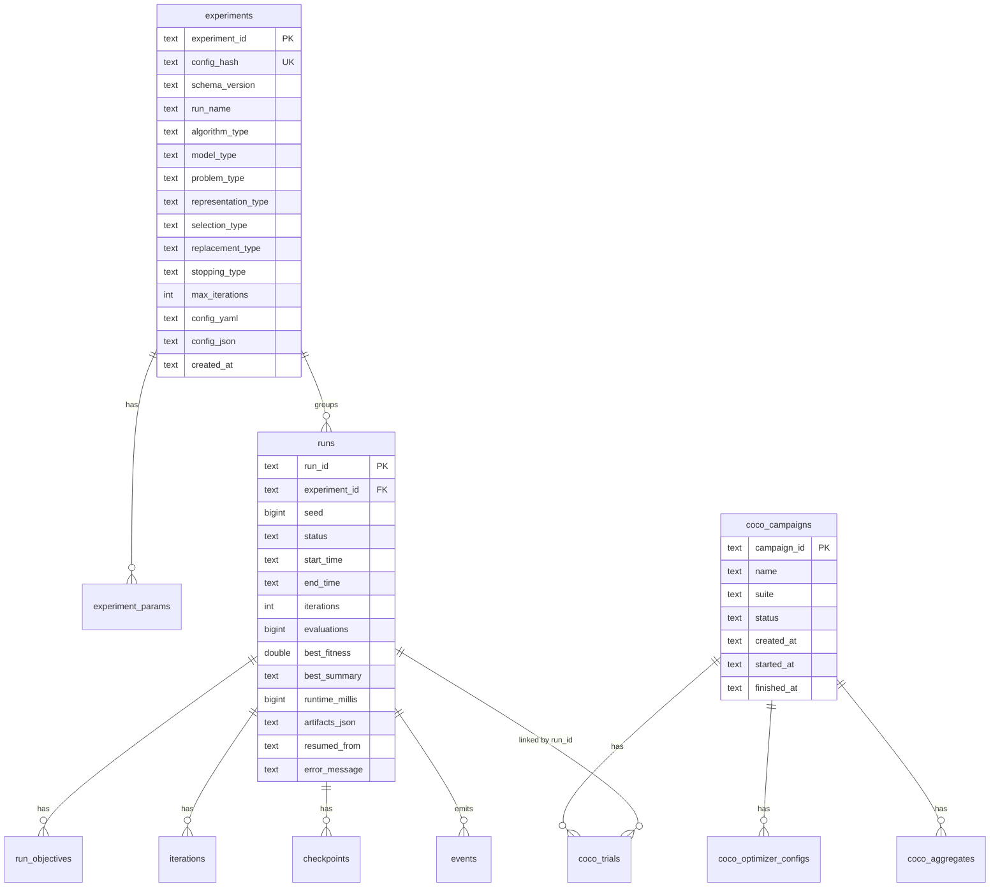

# Database Schema

EDAF persistence supports SQLite by default and PostgreSQL where configured via JDBC URL.

Primary schema source:

- `/Users/karloknezevic/Desktop/EDAF/edaf-persistence/src/main/resources/db/migration/V1__init.sql`

Schema initialization entrypoint:

- `/Users/karloknezevic/Desktop/EDAF/edaf-persistence/src/main/java/com/knezevic/edaf/v3/persistence/jdbc/SchemaInitializer.java`

## 1) Schema Overview

## 2) Core Run Tables

### `experiments`

Stores canonicalized experiment metadata and full config payloads.

Important columns:

- `experiment_id`: stable id derived from `config_hash`
- `config_hash`: SHA-256 of canonical JSON config
- `config_yaml`, `config_json`: canonical snapshots for reproducibility
- typed columns (`algorithm_type`, `model_type`, `problem_type`, ...) used for filtering

### `experiment_params`

Flattened configuration paths for search and filtering.

Path examples:

- `problem.genotype.maxDepth`
- `problem.criteria[0]`
- `problem.genotype.primitives.functionSet[2]`
- `problem.genotype.primitives.terminals[1].name`

`value_type` enum:

- `string`
- `number`
- `boolean`
- `null`
- `json`

### `runs`

One row per execution, linked to one experiment.

Status lifecycle:

- starts as `RUNNING`
- transitions to `COMPLETED` or `FAILED`

### `run_objectives`

Stores final/latest scalar objective-like values extracted from iteration metrics.

### `iterations`

Per-iteration scalar metrics + serialized metric/diagnostic payload JSON.

### `checkpoints`

Checkpoint metadata table (run, iteration, path, timestamp).

### `events`

Raw event stream table with type and JSON payload.

## 3) COCO Campaign Tables

### `coco_campaigns`

Campaign-level metadata and lifecycle state.

### `coco_optimizer_configs`

Optimizer templates participating in the campaign, including persisted canonical YAML.

### `coco_trials`

One row per `(campaign, optimizer, function, instance, dimension, repetition)`.

Stores:

- evaluation budget and achieved evaluations
- best fitness
- success flag (`reached_target`)
- `evals_to_target` when target reached
- run linkage (`run_id`)

### `coco_reference_results`

Imported external benchmark references for comparison (e.g., COCO online sources).

### `coco_aggregates`

Campaign aggregate metrics by optimizer and dimension:

- `success_rate`
- `mean_evals_to_target`
- `edaf_ert`
- `reference_ert`
- `ert_ratio = edaf_ert / reference_ert`

## 4) Required Indexes

Core indexes:

- `runs(start_time DESC)`
- `runs(status)`
- `runs(experiment_id)`
- `runs(best_fitness)`
- `experiments(algorithm_type, problem_type, model_type)`
- `experiment_params(experiment_id, section, leaf_key)`
- `experiment_params(value_text)`
- `iterations(run_id, iteration)`
- `events(run_id, event_type, created_at)`
- `checkpoints(run_id, iteration)`

COCO indexes:

- `coco_campaigns(status)`
- `coco_trials(campaign_id, optimizer_id, dimension, function_id)`
- `coco_trials(run_id)`
- `coco_aggregates(campaign_id, optimizer_id, dimension)`
- `coco_reference_results(suite, optimizer_name, function_id, dimension, target_value)`

## 5) Legacy Schema Handling (No Migration Chain)

`SchemaInitializer` behavior:

1. detect legacy schema condition (`runs` exists but `experiment_id` column missing)
2. if legacy detected:
   - drop managed tables in dependency-safe order
   - recreate schema from `V1__init.sql`
3. if current schema exists:
   - do not wipe data
   - execute idempotent `CREATE TABLE IF NOT EXISTS` + `CREATE INDEX IF NOT EXISTS`

This avoids unnecessary wipes while guaranteeing compatible schema.

## 6) Write Path

Run-level write path (`JdbcEventSink`):

- upserts `experiments`
- rewrites `experiment_params`
- persists raw events
- upserts run/iteration/checkpoint rows
- stores run completion/failure outcome and objectives

COCO campaign write path (`CocoJdbcStore` + `CocoCampaignRunner`):

- upserts campaign start/finish
- persists optimizer templates
- persists trial rows per expanded slice
- rebuilds aggregate rows and reference comparisons

## 7) Read Path

Run read repository (`JdbcRunRepository`) provides:

- paged run listing with search/filter/sort
- run details
- iterations/events/checkpoints/params
- filter facets

COCO read repository (`JdbcCocoRepository`) provides:

- paged campaign listing
- campaign details
- optimizer config rows
- aggregate metrics
- paged trial rows with filters

## 8) Query Safety

Security-relevant guards in read repositories:

- prepared statements for all user-provided filter values
- whitelist for `sortBy` columns
- normalized `sortDir` (`asc|desc`)

This applies to both run and COCO dashboard query endpoints.
