# Database Schema

EDAF persistence supports SQLite by default and PostgreSQL where configured via JDBC URL.

Primary migration script:

- `edaf-persistence/src/main/resources/db/migration/V1__init.sql`

Schema initialization:

- `SchemaInitializer.initialize(dataSource)`

## 1) Schema Overview

```mermaid
erDiagram
    experiments ||--o{ experiment_params : "has"
    experiments ||--o{ runs : "groups"
    runs ||--o{ run_objectives : "has"
    runs ||--o{ iterations : "has"
    runs ||--o{ checkpoints : "has"
    runs ||--o{ events : "emits"

    experiments {
      text experiment_id PK
      text config_hash UK
      text schema_version
      text run_name
      text algorithm_type
      text model_type
      text problem_type
      text representation_type
      text selection_type
      text replacement_type
      text stopping_type
      int max_iterations
      text config_yaml
      text config_json
      text created_at
    }

    experiment_params {
      int id PK
      text experiment_id FK
      text section
      text param_path
      text leaf_key
      text value_type
      text value_text
      double value_number
      int value_boolean
      text value_json
    }

    runs {
      text run_id PK
      text experiment_id FK
      bigint seed
      text status
      text start_time
      text end_time
      int iterations
      bigint evaluations
      double best_fitness
      text best_summary
      bigint runtime_millis
      text artifacts_json
      text resumed_from
      text error_message
    }

    run_objectives {
      int id PK
      text run_id FK
      text objective_name
      double objective_value
    }

    iterations {
      int id PK
      text run_id FK
      int iteration
      bigint evaluations
      double best_fitness
      double mean_fitness
      double std_fitness
      text metrics_json
      text diagnostics_json
      text created_at
    }

    checkpoints {
      int id PK
      text run_id FK
      int iteration
      text checkpoint_path
      text created_at
    }

    events {
      int id PK
      text run_id FK
      text event_type
      text payload_json
      text created_at
    }
```

## 2) Tables

### `experiments`

Stores canonicalized experiment metadata and full config payloads.

Important columns:

- `experiment_id`: stable id derived from config hash
- `config_hash`: SHA-256 of canonical JSON config
- `config_yaml`, `config_json`: canonical snapshots persisted for reproducibility
- typed columns for algorithm/model/problem/etc. used by filtering and faceting

### `experiment_params`

Flattened config paths for search and filtering.

Examples of stored paths:

- `problem.genotype.maxDepth`
- `problem.criteria[0]`
- `problem.genotype.primitives.functionSet[2]`
- `problem.genotype.primitives.terminals[1].name`

`value_type` values:

- `string`
- `number`
- `boolean`
- `null`
- `json`

### `runs`

One row per run instance, linked to `experiments`.

Status lifecycle:

- starts as `RUNNING`
- transitions to `COMPLETED` or `FAILED`

### `run_objectives`

Stores final/latest scalar objective-like values extracted from iteration metrics at completion.

### `iterations`

Stores per-iteration core stats plus raw metrics/diagnostics JSON payloads.

### `checkpoints`

Stores checkpoint metadata (path + iteration + timestamp).

### `events`

Stores raw event JSON with event type and timestamp.

## 3) Required Indexes

Implemented indexes:

- `runs(start_time DESC)`
- `runs(status)`
- `runs(experiment_id)`
- `runs(best_fitness)`
- `experiments(algorithm_type, problem_type, model_type)`
- `experiment_params(experiment_id, section, leaf_key)`
- `experiment_params(value_text)`
- `iterations(run_id, iteration)`
- `events(run_id, event_type, created_at)`
- `checkpoints(run_id, iteration)`

## 4) Legacy Schema Handling (No Migration Chain)

`SchemaInitializer` behavior:

1. detect legacy schema condition:
   - `runs` table exists but column `experiment_id` is missing
2. if legacy detected:
   - drop managed tables in dependency-safe order
   - recreate using `V1__init.sql`
3. if current schema present:
   - do not drop data
   - execute idempotent `CREATE TABLE/INDEX IF NOT EXISTS`

This provides safe reset for incompatible legacy layouts while avoiding unnecessary data wipes.

## 5) Write Path (`JdbcEventSink`)

Write sequence highlights:

- receives `ExperimentConfig` + canonical YAML + canonical JSON
- computes `config_hash` (SHA-256) and `experiment_id`
- upserts `experiments`
- rewrites flattened `experiment_params`
- ensures run skeleton row
- persists raw events
- upserts iteration rows and checkpoints
- finalizes run rows on completion/failure
- upserts `run_objectives` from latest metrics map

## 6) Read Path (`JdbcRunRepository`)

Supports:

- paged run list with filters/sorting/search (`RunQuery`)
- run detail retrieval (`RunDetail`)
- iterations/checkpoints/events/params lists
- facets for filter UI (`algorithm`, `model`, `problem`, `status`)

Security hardening:

- prepared statements for bound values
- whitelisted sort columns (`start_time`, `best_fitness`, `runtime_millis`, `status`)
- restricted sort direction (`asc|desc`)

## 7) Search Semantics

`q` search in run listing includes:

- run id
- algorithm/model/problem
- config hash
- experiment id
- flattened param path
- flattened param `value_text`
- flattened param `value_json`

## 8) API Mapping

Database projections feed web/API DTOs:

- `RunListItem`
- `RunDetail`
- `IterationMetric`
- `CheckpointRow`
- `EventRow`
- `ExperimentParamRow`
- `FilterFacets`

See [Web Dashboard and API](./web-dashboard.md) for endpoint contract.
