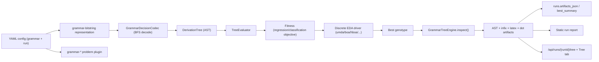
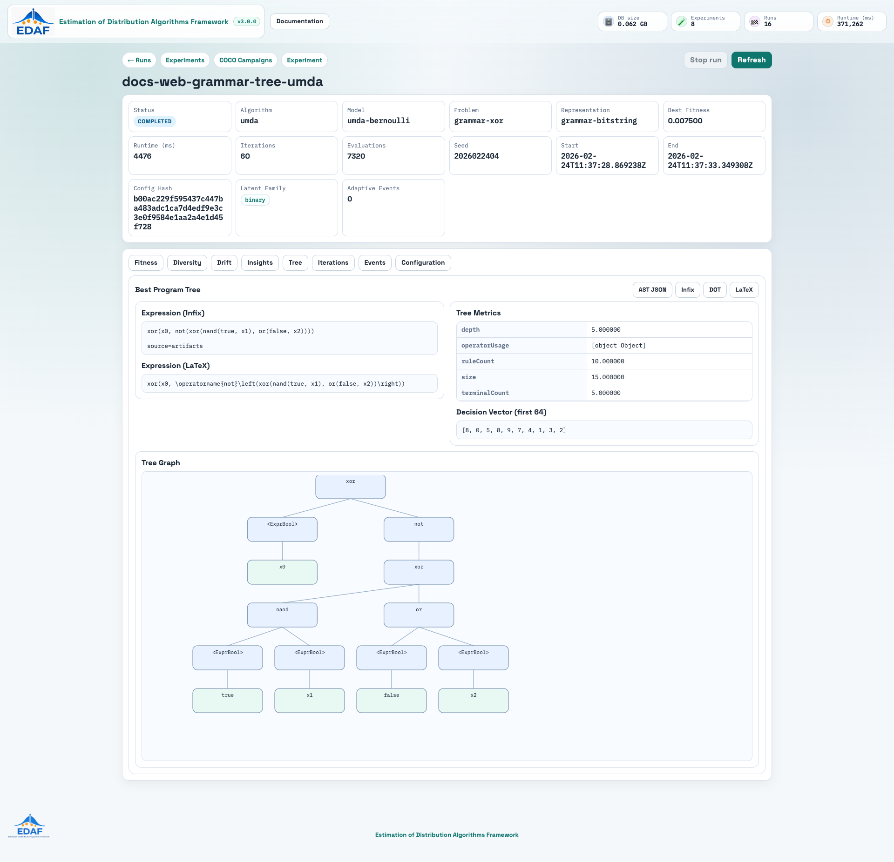
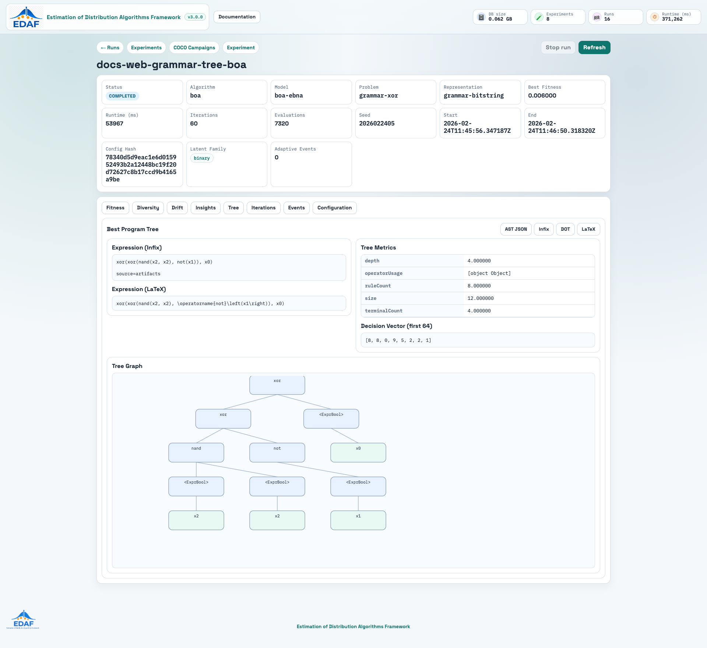
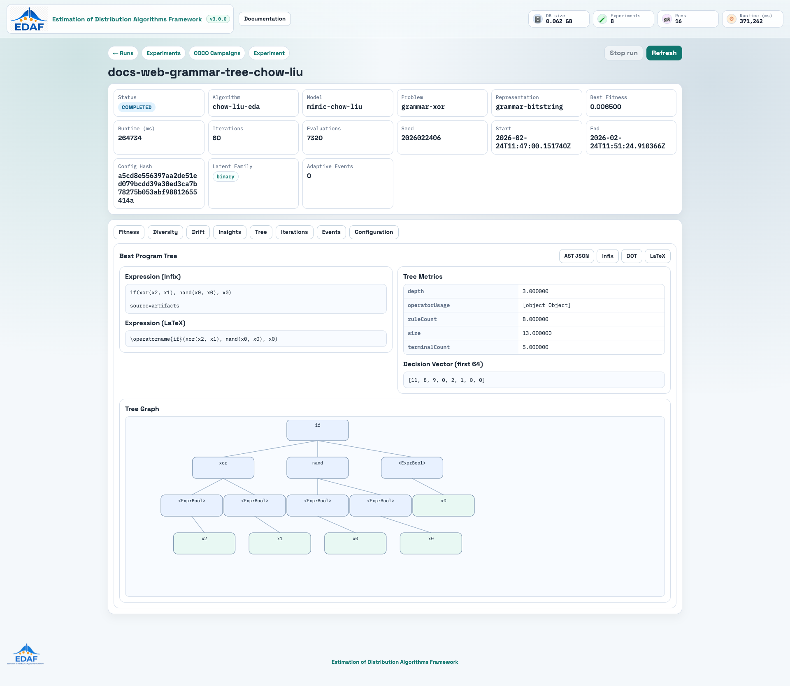
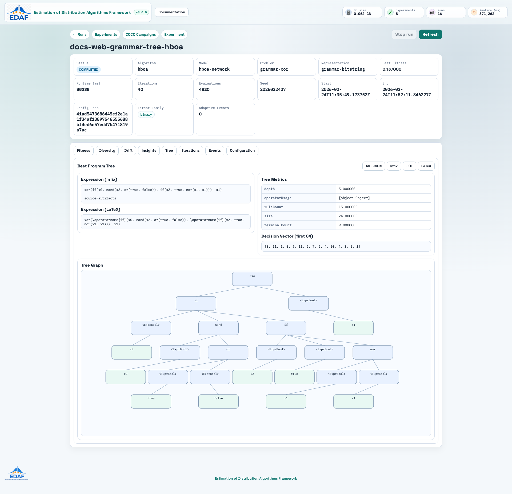

# Grammar-Based GP in EDAF

This document describes the grammar-based symbolic optimization stack in EDAF v3:

- symbolic regression
- symbolic classification
- automatic and custom grammar modes
- ERC (ephemeral random constants)
- deterministic grammar-to-bitstring encoding for discrete EDA drivers
- tree persistence, reporting, and web visualization

The implementation is fully integrated into the existing plugin architecture and uses the same run/persistence/reporting/web pipeline as other EDAF workloads.

## 1. Capability Overview

EDAF now supports grammar-driven program search through representation type:

- `representation.type: grammar-bitstring`

and problem plugins:

- `grammar-xor`
- `grammar-majority`
- `grammar-csv-regression`
- `grammar-csv-classification`
- `grammar-nguyen-regression`

Grammar engine core lives in `edaf-representations` under:

- `<repo-root>/edaf-representations/src/main/java/com/knezevic/edaf/v3/repr/grammar`

Design goals:

- reusable grammar subsystem (not tied to one problem)
- strict separation of grammar definition / decoding / evaluation / rendering
- deterministic mapping from genotype bits to derivation choices
- compatibility with existing discrete EDA algorithms

## 2. End-to-End Flow



## 3. Grammar Modes

## 3.1 `grammar.mode: auto` (recommended)

Auto mode builds grammar from YAML options:

- variables
- operator sets (binary/unary/ternary)
- constants and ERC
- depth constraints
- boolean mode

Example:

```yaml
grammar:
  mode: auto
  variables: [x, y]
  binary_ops: ['+', '-', '*', '/', 'pow', 'min', 'max']
  unary_ops: ['sin', 'cos', 'tan', 'exp', 'log', 'sqrt', 'abs', 'neg']
  ternary_ops: ['if_then_else']
  allow_constants: true
  constants: [-1.0, 0.0, 1.0]
  ephemeral_constants: true
  ephemeral_range: [-5.0, 5.0]
  max_depth: 7
  typed: false
  boolean_mode: false
```

Boolean mode example:

```yaml
grammar:
  mode: auto
  variables: [x0, x1, x2]
  binary_ops: ['and', 'or', 'xor', 'nand', 'nor']
  unary_ops: ['not']
  ternary_ops: ['if']
  allow_constants: false
  ephemeral_constants: false
  max_depth: 7
  typed: false
  boolean_mode: true
```

## 3.2 `grammar.mode: custom` (BNF)

Custom mode loads BNF file and validates:

- unknown symbols
- unreachable non-terminals
- recursion without base case
- operator arity consistency

Example:

```yaml
grammar:
  mode: custom
  file: grammar_gp_suite/custom_grammar/polynomial-only.bnf
  variables: [x]
  max_depth: 7
  ephemeral_constants: true
  ephemeral_range: [-3.0, 3.0]
```

Implemented examples:

- `<repo-root>/configs/grammar_gp_suite/custom_grammar/polynomial-only.bnf`
- `<repo-root>/configs/grammar_gp_suite/custom_grammar/boolean-only.bnf`

## 4. BNF Format

Supported syntax:

- `<NonTerminal> ::= alternative1 | alternative2`
- multi-line alternatives (continuation lines)
- comments using `#` or `//`
- quoted tokens are supported

Terminals can be:

- operator symbol from registry (`+`, `sin`, `and`, ...)
- numeric literal (`1.0`, `-2`)
- boolean literal (`true`, `false`)
- declared variable (`x`, `x0`, `petal_length`, ...)
- `erc` (if `ephemeral_constants: true`)

Minimal example:

```bnf
<Expr> ::= + <Expr> <Expr> | sin <Expr> | x | 1.0 | erc
```

Boolean example:

```bnf
<BoolExpr> ::= and <BoolExpr> <BoolExpr> | not <BoolExpr> | x0 | true | false
```

## 5. ERC (Ephemeral Random Constants)

ERC is represented via `EphemeralConstantTerminal`.

Behavior:

- sampled during decode from genotype bits
- deterministic for same genotype/config
- constrained to `ephemeral_range`
- persisted in AST and tree payload

Persistence outputs include ERC values in:

- tree API payload (`ercValues`)
- run artifacts (`bestAstJson`, expression exports)

## 6. Deterministic Encoding Strategy

Grammar programs are encoded as fixed-length bitstrings to reuse discrete EDA algorithms.

Key properties:

- BFS non-terminal expansion
- fixed `bitsPerDecision`
- depth-limited expansion (`max_depth`)
- deterministic fallback closure when depth/nodes are exceeded
- optional ERC bit budget (`bits_per_erc`)

Encoding metadata:

- `maxDepth`
- `maxNodes`
- `bitsPerDecision`
- `bitsPerErc`
- `genomeLength`

This ensures repeatability and compatibility with:

- `umda`
- `pbil`
- `cga`
- `mimic`
- `chow-liu-eda`
- `dependency-tree-eda`
- `bmda`
- `boa`
- `hboa`
- `ebna`
- `factorized-discrete-eda`

## 7. Operator Registry

Registry class:

- `<repo-root>/edaf-representations/src/main/java/com/knezevic/edaf/v3/repr/grammar/ops/OperatorRegistry.java`

Implemented operator groups:

- real binary: `+ - * / pow min max`
- real unary: `sin cos tan exp log sqrt abs neg`
- real ternary: `if_then_else`
- boolean: `and or xor not nand nor if`

Protected semantics:

- division: safe denominator handling
- log: `log(abs(x) + eps)`
- sqrt: `sqrt(abs(x))`
- pow: exponent/value clamping

## 8. Problem Types and Datasets

## 8.1 Built-in boolean tasks

- `grammar-xor`
- `grammar-majority`

## 8.2 Built-in regression tasks

- `grammar-nguyen-regression` (variants 1..8)
- `grammar-csv-regression`

## 8.3 Built-in classification tasks

- `grammar-csv-classification`

`grammar-csv-classification` now supports both binary and multiclass datasets.

Key problem params:

- `classificationMode`: `auto` (default), `binary`, `multiclass`
- `score`:
  - binary: `accuracy`, `f1`
  - multiclass: `accuracy`, `macro_f1` (`f1` is treated as `macro_f1`)
- `classValues` (optional): explicit class label order for stable mapping, e.g. `[0, 1, 2]`
- `positiveLabel` (binary mode): positive class label, default `1`
- `binaryThreshold` (binary mode): threshold on numeric expression output, default `0.5`

Committed datasets:

- `<repo-root>/edaf-problems/src/main/resources/datasets/grammar/regression/nguyen_like.csv`
- `<repo-root>/edaf-problems/src/main/resources/datasets/grammar/regression/timeseries_wave.csv`
- `<repo-root>/edaf-problems/src/main/resources/datasets/grammar/classification/iris_binary.csv`
- `<repo-root>/edaf-problems/src/main/resources/datasets/grammar/classification/wine_quality_binary.csv`
- `<repo-root>/edaf-problems/src/main/resources/datasets/grammar/classification/iris_multiclass.csv`
- `<repo-root>/edaf-problems/src/main/resources/datasets/grammar/classification/wine_recognition_multiclass.csv`

Dataset refresh script:

- `<repo-root>/scripts/download-grammar-datasets.sh`

## 9. Experiment Config Suite

Full suite:

- `<repo-root>/configs/grammar_gp_suite`

Contains:

- 5 boolean auto-mode configs
- 5 regression auto-mode configs
- 10 classification auto-mode configs (`iris multiclass` + `wine recognition multiclass`)
- 2 custom-grammar configs

All include:

- `run.runCount: 10`
- DB sink enabled
- report generation enabled
- web-compatible artifacts

Run one config:

```bash
cd <repo-root>
./edaf run -c configs/grammar_gp_suite/boolean/boolean-xor3-umda.yml
./edaf run -c configs/grammar_gp_suite/classification/classification-iris-hboa.yml
./edaf run -c configs/grammar_gp_suite/classification/classification-wine-multiclass-hboa.yml
```

## 10. Web UI Tree Visualization

For grammar runs, the run detail page now has `Tree` tab:

- Infix expression
- LaTeX expression
- tree metrics table
- decision vector preview + ERC values
- SVG tree graph
- download buttons:
  - AST JSON
  - Infix text
  - DOT graph
  - LaTeX expression

API endpoint:

- `GET /api/runs/{runId}/tree`

Service:

- `<repo-root>/edaf-web/src/main/java/com/knezevic/edaf/v3/web/service/GrammarTreeViewService.java`

Representative Tree tab screenshots (same XOR grammar, different EDA drivers):






## 11. Persistence and Artifacts

Grammar payload is persisted in run artifacts JSON (when best genotype exists):

- `bestExpressionInfix`
- `bestExpressionPrefix`
- `bestExpressionLatex`
- `bestExpressionDot`
- `bestAstJson`
- `bestTreeMetrics`
- `decisionVector`
- `ercValues`

Filesystem artifacts generated per run:

- `best-expression.txt`
- `best-expression.tex`
- `best-expression.dot`
- `best-ast.json`

## 12. Reporting

Standard per-run report generation remains active.

Grammar runs additionally include expression/AST artifacts that can be linked from:

- summary JSON
- DB run detail payload
- web run tree endpoint

## 13. How to Add New Grammar Problems

1. Add problem class extending `AbstractGrammarBitStringProblem`.
2. Implement `evaluate(BitString genotype)` and objective logic.
3. Add plugin implementing `ProblemPlugin<BitString>`.
4. Register plugin in service file:
   - `<repo-root>/edaf-problems/src/main/resources/META-INF/services/com.knezevic.edaf.v3.core.plugins.ProblemPlugin`
5. Add one runnable YAML config under `configs/`.
6. Add tests and update docs.

## 14. How to Add New Grammar Operators

1. Register operator in `OperatorRegistry`.
2. Assign operator kind and arity.
3. Implement protected semantics if numerically unsafe.
4. Add tests for evaluator correctness and finite outputs.
5. Update docs with usage in auto/custom mode.

## 15. Test Coverage Added for Grammar Engine

Unit tests now cover:

- BNF parser safety checks
- auto grammar construction
- protected operator behavior
- deterministic decode and ERC reproducibility
- tree evaluator correctness

Test package:

- `<repo-root>/edaf-representations/src/test/java/com/knezevic/edaf/v3/repr/grammar`

Run:

```bash
cd <repo-root>
mvn -q -pl edaf-representations -am test
```

## 16. Troubleshooting

`No grammar tree visualization payload available for run`:

- run is not `grammar-bitstring`, or
- best genotype missing, or
- run has no persisted artifacts yet

`Unknown terminal token ...` in custom grammar:

- token is not in variables list
- operator not in registry
- numeric/boolean literal malformed

`recursive without base case`:

- add at least one terminating alternative (constant/variable/literal/erc).

---
Estimation of Distribution Algorithms Framework  
Copyright (c) 2026 Dr. Karlo Knezevic  
Licensed under the Apache License, Version 2.0.
