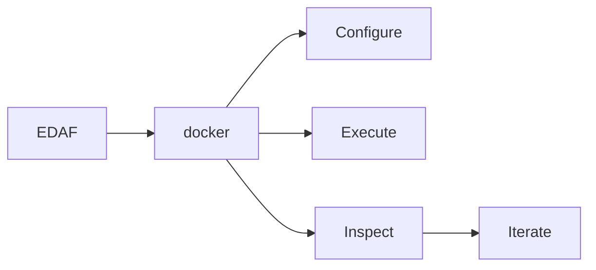

# Docker Guide

EDAF includes container recipes for a complete stack:

- PostgreSQL database
- Web dashboard
- Runner container executing one experiment config

## 1) Files

- `Dockerfile.web`
- `Dockerfile.runner`
- `docker-compose.yml`
- `configs/docker/umda-onemax-postgres-v3.yml`

## 2) Build and Start

```bash
./scripts/docker-stack.sh up
```

Detached mode:

```bash
./scripts/docker-stack.sh up-all
```

## 3) Services and Ports

- `db`: PostgreSQL 16 on `localhost:5432`
- `web`: dashboard on `localhost:7070`
- `runner`: executes `edaf run -c /app/configs/docker/umda-onemax-postgres-v3.yml`

## 4) Runtime Data

Compose mounts host directories for runner outputs:

- `./results -> /app/results`
- `./reports -> /app/reports`

PostgreSQL state is persisted in Docker volume:

- `edaf-db-data`

## 5) Inspect and Monitor

```bash
./scripts/docker-stack.sh status
./scripts/docker-stack.sh logs
```

## 6) Stop / Restart / Destroy

Stop containers but keep state:

```bash
./scripts/docker-stack.sh down
```

Restart stopped containers:

```bash
docker compose start
```

Shutdown and remove containers/network (keep volume):

```bash
./scripts/docker-stack.sh down
```

Shutdown and remove containers/network/volume:

```bash
./scripts/docker-stack.sh down-volumes
```

## 7) Re-run Runner Only

If DB and web are already up and you want another run:

```bash
docker compose run --rm runner run -c /app/configs/docker/umda-onemax-postgres-v3.yml
```

## 8) Use a Different Config in Runner

Option A: edit `docker-compose.yml` runner command.

Option B: one-off run:

```bash
docker compose run --rm runner run -c /app/configs/gaussian-sphere-v3.yml
```

If that config should write to PostgreSQL, ensure `persistence.database.url/user/password` match compose DB settings.

## 9) Smoke Test Endpoints

```bash
curl "http://localhost:7070/api/facets"
curl "http://localhost:7070/api/runs?page=0&size=10"
```

## 10) Troubleshooting

### Web starts but no runs visible

- verify runner config uses `db` sink
- verify runner config points to PostgreSQL URL (not local SQLite)
- check runner logs for JDBC errors

### Port conflicts

- change `7070:7070` or `5432:5432` mappings in `docker-compose.yml`

### Clean reset

```bash
./scripts/docker-stack.sh down-volumes
./scripts/docker-stack.sh up-all
```


## Visual Summary



## Build Context Hygiene

EDAF includes `<repo-root>/.dockerignore` to keep Docker build context small and predictable.

Key ignored paths:

- runtime artifacts (`results/`, `reports/`, `*.db`, `*.log`)
- Maven output (`target/`, `**/target/`)
- local caches (`**/.jqwik-database/`)
- VCS/editor metadata (`.git/`, `.vscode/`, `.idea/`)

Without this, build context can become multiple GB and dramatically slow down image builds.

---
Estimation of Distribution Algorithms Framework  
Copyright (c) 2026 Dr. Karlo Knezevic  
Licensed under the Apache License, Version 2.0.
