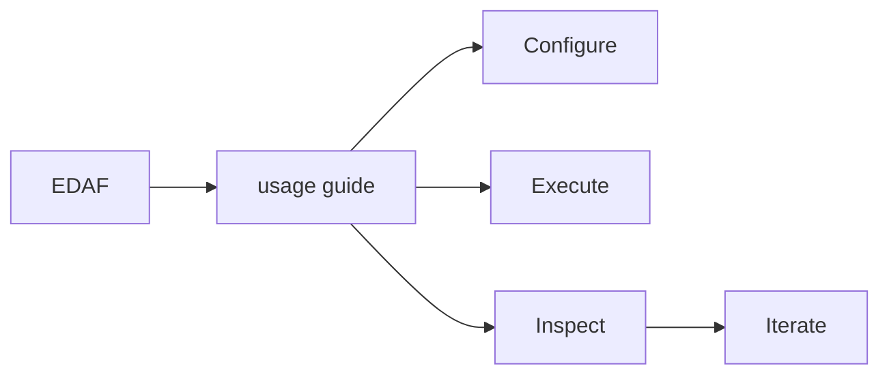

# Usage Guide

This guide is a practical cookbook for common EDAF workflows.

## 1) Build and Validate Environment

```bash
cd <repo-root>
mvn -q clean test
./edaf --help
```

Optional one-time cleanup of legacy root logs:

```bash
mkdir -p results/logs/legacy-root
mv edaf-v3.log edaf-v3.log.* edaf.log results/logs/legacy-root/ 2>/dev/null || true
```

## 2) Core Run Recipes

### Recipe A: Discrete baseline (UMDA + OneMax)

```bash
./edaf run -c configs/umda-onemax-v3.yml
```

### Recipe B: Continuous baseline with checkpoints

```bash
./edaf run -c configs/gaussian-sphere-v3.yml
```

Resume from checkpoint:

```bash
./edaf resume --checkpoint results/checkpoints/gaussian-sphere-v3-iter-50.ckpt.yaml
```

### Recipe C: Permutation baseline (EHM + small TSP)

```bash
./edaf run -c configs/ehm-tsp-v3.yml
```

### Recipe D: Batch execution

```bash
./edaf batch -c configs/batch-v3.yml
```

Batch/Campaign parallelism is now automatic and coordinated with in-run fitness parallelism.

- run-level parallelism hint: `availableProcessors / 2`
- per-run fitness workers: dynamic `availableProcessors / activeRuns`
- optional environment overrides:
  - `EDAF_BATCH_PARALLELISM`
  - `EDAF_MAX_FITNESS_WORKERS`
  - `EDAF_ASYNC_SINK_QUEUE` (async persistence sink queue capacity)

### Recipe D2: 30-run statistical batch per experiment

```bash
./edaf batch -c configs/batch-stat-sample-v3.yml
```

This file uses per-entry `repetitions`, `seedStart`, and `runIdPrefix` so one logical experiment produces many runs suitable for statistical tests.

### Recipe E: Full cross-domain benchmark set (non-COCO)

```bash
./edaf batch -c configs/batch-benchmark-core-v3.yml
```

This batch runs and persists:

- OneMax
- Knapsack
- MAX-SAT
- TSPLIB TSP (Berlin52)
- CEC2014
- ZDT
- DTLZ
- Nguyen symbolic regression

### Recipe F: Boolean-function cryptography benchmark set

```bash
./edaf batch -c configs/batch-benchmark-crypto-v3.yml
```

This batch runs and persists:

- truth-table boolean-function optimization
- balanced permutation boolean-function optimization
- token-tree boolean-function optimization
- multi-objective boolean-function baseline

### Recipe G: Significance campaign (same problem, multiple algorithms, 30x runs)

```bash
./edaf batch -c configs/batch-significance-onemax-v3.yml
```

This campaign runs `umda` and `pbil` on `onemax` with identical deterministic seed schedules,
so `/api/analysis/problem/onemax` can compute paired Friedman/Wilcoxon-style statistics.

### Recipe H: Disjunct Matrix family (DM/RM/ADM)

```bash
./edaf run -c configs/benchmarks/disjunct-matrix-dm-v3.yml
./edaf run -c configs/benchmarks/disjunct-matrix-rm-v3.yml
./edaf run -c configs/benchmarks/disjunct-matrix-adm-v3.yml
```

These configs use exact paper fitness functions:

- DM: `fit1(A) = sum delta(S)`
- RM: `fit2(A) = |{S: delta(S) > f}|`
- ADM: `fit3(A) = fit1(A) / (C(N,t) * (N-t))`

Detailed semantics and validator API:

- `docs/benchmarks/disjunct-matrix-problems.md`

### Recipe I: Full paper-instance multi-algorithm campaign (DM/RM/ADM)

Generate campaign configs (mandatory + optional algorithms):

```bash
./scripts/adm_paper_suite/generate_configs.py --include-optional
```

Run mandatory 30x campaign:

```bash
./edaf batch -c configs/adm_paper_suite/batch-paper-mandatory-30.yml
```

Run full 30x campaign (mandatory + optional):

```bash
./edaf batch -c configs/adm_paper_suite/batch-paper-full-30.yml
```

Build comparative report bundle from DB:

```bash
./scripts/adm_paper_suite/build_comparison_report.py \
  --db edaf-v3.db \
  --metadata configs/adm_paper_suite/paper-suite-metadata.csv \
  --out reports/adm_paper_suite
```

Detailed campaign specification:

- `docs/benchmarks/adm-paper-suite.md`

## 2.1) Latent-Knowledge Demo Configs (10+)

All latent demos are in:

- `configs/latent-insights/`

Included runs:

- Binary (3): `binary-onemax-umda-latent.yml`, `binary-onemax-pbil-latent.yml`, `binary-knapsack-bmda-latent.yml`
- Permutation (3): `permutation-smalltsp-ehm-latent.yml`, `permutation-smalltsp-mallows-latent.yml`, `permutation-tsplib-ehbsa-latent.yml`
- Real-valued (3): `real-sphere-gaussian-latent.yml`, `real-rastrigin-snes-latent.yml`, `real-rosenbrock-cma-latent.yml`
- Adaptive showcase (1): `adaptive-showcase-onemax-collapse.yml` (configured to trigger adaptive events)

Run any demo:

```bash
./edaf run -c configs/latent-insights/binary-onemax-umda-latent.yml
./edaf run -c configs/latent-insights/permutation-smalltsp-ehm-latent.yml
./edaf run -c configs/latent-insights/real-sphere-gaussian-latent.yml
./edaf run -c configs/latent-insights/adaptive-showcase-onemax-collapse.yml
```

## 2.2) Per-Run Artifact Bundle (always generated when `persistence.enabled=true`)

Each run now creates:

- `results/.../runs/<runId>/config-resolved.yaml`
- `results/.../runs/<runId>/config-resolved.json`
- `results/.../runs/<runId>/telemetry.jsonl`
- `results/.../runs/<runId>/events.jsonl`
- `results/.../runs/<runId>/metrics.csv`
- `results/.../runs/<runId>/summary.json`
- `results/.../runs/<runId>/report.html`
- `results/.../logs/*.log` (when `logging.modes` contains `file`)

Notes about logs:

- file logs are optional; disable by removing `file` from `logging.modes`
- JSONL/CSV/DB are usually enough for large campaigns
- relative file-log paths are automatically normalized under `persistence.outputDirectory` so project root stays clean

Open static report directly:

```bash
open results/latent-insights/runs/latent-adaptive-showcase-onemax/report.html
```

Telemetry rows include:

- generation, evaluations, population size, elite size
- best/mean/std fitness
- representation family
- algorithm/model/problem IDs
- latent metrics payload
- drift/diversity payload
- adaptive actions for that generation

## 2.3) What You Can Control in YAML (Latent + Adaptive)

Latent extraction and adaptive behavior are configured in `algorithm` params.

Most important tuning keys:

- latent extraction:
  - `latentTopK`
  - `latentDependencyTopK`
  - `latentPairwiseMaxDimensions`
  - `latentPairSampleLimit`
  - `latentFixationEpsilon`
  - `latentDependencyEnabled`
- adaptive toggles:
  - `adaptiveEnabled`
  - `adaptiveEarlyIterationLimit`
  - `adaptiveExplorationFraction`
  - `adaptiveExplorationNoiseRate`
  - `adaptiveStagnationGenerations`
  - `adaptivePartialRestartFraction`
- family thresholds:
  - binary: `adaptiveBinaryEntropyThreshold`, `adaptiveBinaryFixationThreshold`, `adaptiveBinaryEntropyDropThreshold`, `adaptiveBinaryDiversityThreshold`
  - permutation: `adaptivePermutationEntropyThreshold`, `adaptivePermutationDiversityThreshold`
  - real: `adaptiveRealSigmaThreshold`, `adaptiveRealDiversityThreshold`, `adaptiveRealNoiseScale`

Practical behavior:

- lower collapse thresholds -> later exploration boosts
- higher collapse thresholds -> earlier exploration boosts
- larger `adaptivePartialRestartFraction` -> stronger recovery from stagnation

Detailed semantics:

- `docs/runtime/latent-insights.md`
- `docs/foundations/configuration.md`

## 2.4) How to Use the Insights After a Run

Recommended workflow:

1. Run one config:
   - `./edaf run -c configs/latent-insights/adaptive-showcase-onemax-collapse.yml`
2. Open static report:
   - `results/latent-insights/runs/latent-adaptive-showcase-onemax/report.html`
3. Start web app:
   - `EDAF_DB_URL="jdbc:sqlite:$(pwd)/edaf-v3.db" mvn -q -pl edaf-web -am org.springframework.boot:spring-boot-maven-plugin:run`
4. Open:
   - `http://localhost:7070/runs/latent-adaptive-showcase-onemax`
5. Inspect:
   - `Insights` tab for family-specific charts
   - `Events` tab with `eventType=adaptive_action`
   - `Configuration` tab to confirm threshold params used in that run
6. Tune YAML thresholds and rerun with same `masterSeed` for reproducible A/B comparisons.

## 2.5) Grammar-Based GP Suite (Symbolic Regression/Classification)

Grammar GP suite location:

- `configs/grammar_gp_suite/`

Included:

- `boolean/` (5 configs: `umda`, `chow-liu-eda`, `boa`, `hboa`, `ebna`)
- `regression/` (5 configs with Nguyen regression)
- `classification/`:
  - 5 configs with Iris multiclass classification (`classValues: [0,1,2]`)
  - 5 configs with Wine Recognition multiclass classification (13 features, 3 classes)
- `custom_grammar/` (2 custom BNF examples + runnable configs)

All suite configs are pre-set with:

- `run.runCount: 10`
- DB persistence (`jdbc:sqlite:edaf-v3.db`)
- CSV/JSONL telemetry
- HTML report output

Run examples:

```bash
./edaf run -c configs/grammar_gp_suite/boolean/boolean-xor3-umda.yml
./edaf run -c configs/grammar_gp_suite/regression/regression-nguyen5-boa.yml
./edaf run -c configs/grammar_gp_suite/classification/classification-iris-hboa.yml
./edaf run -c configs/grammar_gp_suite/classification/classification-wine-multiclass-hboa.yml
./edaf run -c configs/grammar_gp_suite/custom_grammar/custom-polynomial-regression-boa.yml
```

Custom grammar examples:

- `configs/grammar_gp_suite/custom_grammar/polynomial-only.bnf`
- `configs/grammar_gp_suite/custom_grammar/boolean-only.bnf`

Detailed grammar documentation:

- `docs/grammar-based-gp.md`

## 3) COCO/BBOB Recipes

### Build and import fuller reference rows (recommended)

Build importer CSV from official COCO ppdata:

```bash
./scripts/coco/build_reference_from_ppdata.py \
  --functions 1,2,3,8,15 \
  --dimensions 2,5,10,20 \
  --target-label 1e-7 \
  --target-value 1e-7 \
  --out configs/coco/reference/coco-reference-bbob-ppdata-2009-2023-f1-2-3-8-15-d2-5-10-20-t1e-7.csv
```

Import into DB:

```bash
sqlite3 edaf-v3.db "DELETE FROM coco_reference_results WHERE suite='bbob';"
./edaf coco import-reference \
  --csv configs/coco/reference/coco-reference-bbob-ppdata-2009-2023-f1-2-3-8-15-d2-5-10-20-t1e-7.csv \
  --suite bbob \
  --source-url https://numbbo.github.io/ppdata-archive/bbob/ \
  --db-url jdbc:sqlite:edaf-v3.db
```

### Run smoke campaign

```bash
./edaf coco run -c configs/coco/bbob-smoke-v3.yml
```

### Run full campaign

```bash
./edaf coco run -c configs/coco/bbob-campaign-v3.yml
```

### Run larger publishable campaign

```bash
./edaf coco run -c configs/coco/bbob-publishable-v4.yml
```

### Run CMA-ES comparison campaign

```bash
./edaf coco run -c configs/coco/bbob-cma-compare-v3.yml
```

### Rebuild campaign report from DB

```bash
./edaf coco report \
  --campaign-id coco-bbob-publishable-v4 \
  --out reports/coco \
  --db-url jdbc:sqlite:edaf-v3.db
```

## 4) Configuration Validation Recipes

```bash
./edaf config validate configs/umda-onemax-v3.yml
./edaf config validate configs/gaussian-sphere-v3.yml
./edaf config validate configs/ehm-tsp-v3.yml
./edaf config validate configs/batch-v3.yml
```

## 5) Plugin Discovery Recipes

```bash
./edaf list algorithms
./edaf list models
./edaf list problems
```

## 6) Reporting Recipes

SQLite:

```bash
./edaf report --run-id umda-onemax-v3 --out reports --db-url jdbc:sqlite:edaf-v3.db
```

PostgreSQL:

```bash
./edaf report --run-id docker-umda-onemax-v3 --out reports --db-url jdbc:postgresql://localhost:5432/edaf --db-user edaf --db-password edaf
```

Multiple formats:

```bash
./edaf report --run-id umda-onemax-v3 --out reports --formats html,latex
```

## 7) Web Dashboard Recipes

Open a terminal in `<repo-root>` and run from repo root:

```bash
EDAF_DB_URL="jdbc:sqlite:$(pwd)/edaf-v3.db" mvn -q -pl edaf-web -am org.springframework.boot:spring-boot-maven-plugin:run
```

Alternative (works only if spring-boot plugin prefix is resolvable in your local Maven setup):

```bash
EDAF_DB_URL="jdbc:sqlite:$(pwd)/edaf-v3.db" mvn -q -pl edaf-web -am org.springframework.boot:spring-boot-maven-plugin:run
```

`-pl edaf-web -am` is important because the web module depends on sibling modules; running from repo root ensures all required classes are on classpath.

Stop web server with `Ctrl+C` in the same terminal.

Open:

- [http://localhost:7070](http://localhost:7070)

UI pages:

- `/` run explorer
- `/experiments` experiment explorer (multi-run grouped view)
- `/runs/{runId}` run detail
- `/experiments/{experimentId}` experiment detail (multi-run analytics)
- `/coco` campaign explorer
- `/coco/{campaignId}` campaign detail

Experiment deletion:

- `/experiments`: each row has **Stop** and **Delete**, plus bulk **Stop selected** / **Delete selected**
- `/experiments/{experimentId}`: top toolbar has **Stop experiment** and **Delete experiment**
- `/runs/{runId}`: top bar has **Stop run**
- delete removes DB rows (`experiments`, `runs`, `iterations`, `checkpoints`, `events`, `experiment_params`, `run_objectives`) and best-effort run artifact directories
- delete is blocked with `409 CONFLICT` when the experiment still has `RUNNING` runs
- stop is cooperative/safe: running jobs finish current iteration and persist `STOPPED` status with final telemetry snapshot

### Run detail (`/runs/{runId}`) deep-dive

Tabs and practical usage:

- `Fitness`:
  - line chart with `Best`, `Mean`, `Std` per iteration
  - hover on one x-position shows all series values for that iteration
- `Diversity`:
  - population/elite diversity curves
  - includes info button explaining interpretation (exploration collapse vs healthy spread)
- `Drift`:
  - model-drift signal per iteration
  - includes info button for stagnation interpretation
- `Insights`:
  - representation-specific visualizations:
    - binary: entropy heatmap, top changing bit probabilities, fixation ratio, dependency edges
    - permutation: position heatmap, consensus drift, adjacency edges
    - real: sigma heatmap, mean trajectories, eigen summary
  - `Focus` mode for heatmaps:
    - opens only on explicit click (no auto-open)
    - close with `Close`, backdrop click, or `Esc`
    - supports zoom, custom color range, pin/unpin tooltip
- `Iterations`:
  - sortable table by iteration/evals/pop/elite/best/mean/std/adaptive count
- `Events`:
  - adaptive timeline + raw event stream
  - type filter + payload text search + paging
- `Configuration`:
  - YAML/JSON toggle
  - flattened param table with search and sortable columns

Visual status colors are consistent across pages:

- `RUNNING`: green badge
- `COMPLETED`: blue badge
- `FAILED`: red badge
- `STOPPED`: amber badge
- fallback/other states: amber badge

### Experiment detail (`/experiments/{experimentId}`) analytics

The experiment page aggregates multiple stochastic runs (for example, 30 seeds) and now includes:

- Mean convergence + 95% CI:
  - x-axis: evaluations
  - y-axis: best fitness
  - mean curve + CI band + median curve
  - traces are aligned on common evaluation budgets using forward-fill
- Success-vs-budget:
  - solved fraction by evaluation budget
  - uses configured target condition from analysis query or stored config
- Time-to-target histogram:
  - evaluations-to-target distribution over successful runs
  - caption shows successes vs non-successes
- Final fitness boxplot + histogram:
  - distribution across all runs
- ECDF of evaluations-to-target:
  - total-runs normalized ECDF
  - successful-only ECDF
- Data/Performance profiles:
  - benchmarking-oriented profile views remain available

Target selection source is explicit in analytics:

- query parameter `target` (highest priority), or
- experiment config (`stopping.targetFitness` / `target`), or
- none (fallback semantics).

## 8) API Query Recipes

### Run list with pagination

```bash
curl "http://localhost:7070/api/runs?page=0&size=25&sortBy=start_time&sortDir=desc"
```

### Experiment list with pagination

```bash
curl "http://localhost:7070/api/experiments?page=0&size=25&sortBy=latest_run_time&sortDir=desc"
curl "http://localhost:7070/api/experiments?algorithm=umda&problem=onemax&q=maxDepth"
```

### Experiment status filter

`/api/experiments` and `/experiments` support experiment-level status categories:

- `RUNNING`: at least one run in experiment is currently running
- `COMPLETED`: all runs are completed
- `FAILED`: all runs failed
- `PARTIAL`: mixed/non-terminal run states (excluding active `RUNNING`)

```bash
curl "http://localhost:7070/api/experiments?status=RUNNING"
curl "http://localhost:7070/api/experiments?algorithm=boa&problem=disjunct-matrix&status=PARTIAL"
```

### Filter by algorithm/problem/status

```bash
curl "http://localhost:7070/api/runs?algorithm=umda&problem=onemax&status=COMPLETED"
curl "http://localhost:7070/api/runs?problem=knapsack&status=COMPLETED"
curl "http://localhost:7070/api/runs?problem=cec2014&status=COMPLETED"
curl "http://localhost:7070/api/runs?problem=zdt&status=COMPLETED"
curl "http://localhost:7070/api/runs?problem=boolean-function&status=COMPLETED"
```

### Full-text-like search across run and flattened params

```bash
curl "http://localhost:7070/api/runs?q=problem.genotype.maxDepth"
```

### Range filtering

```bash
curl "http://localhost:7070/api/runs?from=2026-02-01T00:00:00Z&to=2026-02-20T00:00:00Z&minBest=20&maxBest=100"
```

### Run detail resources

```bash
curl "http://localhost:7070/api/runs/umda-onemax-v3"
curl "http://localhost:7070/api/runs/umda-onemax-v3/iterations"
curl "http://localhost:7070/api/runs/umda-onemax-v3/checkpoints"
curl "http://localhost:7070/api/runs/umda-onemax-v3/params"
curl "http://localhost:7070/api/runs/umda-onemax-v3/events?eventType=iteration_completed&q=entropy&page=0&size=20"
```

### Experiment-level analytics and LaTeX export

```bash
curl "http://localhost:7070/api/experiments/<experimentId>"
curl -X DELETE "http://localhost:7070/api/experiments/<experimentId>"
curl -X POST "http://localhost:7070/api/experiments/<experimentId>/stop" -H "Content-Type: application/json" -d '{"reason":"manual stop"}'
curl -X POST "http://localhost:7070/api/runs/<runId>/stop" -H "Content-Type: application/json" -d '{"reason":"manual stop"}'
curl -X POST "http://localhost:7070/api/experiments/delete-bulk" -H "Content-Type: application/json" -d '{"experimentIds":["exp-1","exp-2"]}'
curl "http://localhost:7070/api/experiments/<experimentId>/runs?page=0&size=50&sortBy=start_time&sortDir=desc"
curl "http://localhost:7070/api/experiments/<experimentId>/analysis?direction=max&target=60"
curl "http://localhost:7070/api/experiments/<experimentId>/latex?direction=max&target=60"
```

`/api/experiments/{experimentId}/analysis` now returns (in addition to box/profile stats):

- `targetFitness`, `targetSource`
- `convergence95Ci[]` with:
  - `x`, `mean`, `ciLower`, `ciUpper`, `median`, `samples`
- `successVsBudget[]`
- `timeToTargetHistogram[]` (`startInclusive`, `endExclusive`, `count`)
- `ecdfTotalRuns[]`
- `ecdfSuccessfulRuns[]`

### Same-problem algorithm significance analysis

```bash
curl "http://localhost:7070/api/analysis/problem/onemax?direction=max&target=60"
curl "http://localhost:7070/api/analysis/problem/onemax/latex?direction=max&target=60"
```

### Advanced algorithm benchmarks

```bash
./edaf run -c configs/benchmarks/onemax-hboa-v3.yml
./edaf run -c configs/benchmarks/sphere-full-cov-v3.yml
./edaf run -c configs/benchmarks/sphere-flow-eda-v3.yml
```

Resume checkpoints:

```bash
./edaf resume --checkpoint results/benchmarks/checkpoints/benchmark-sphere-full-cov-v3-iter-100.ckpt.yaml
./edaf resume --checkpoint results/benchmarks/checkpoints/benchmark-sphere-flow-eda-v3-iter-100.ckpt.yaml
```

For browser workflow:

1. Open one run from `/`.
2. Click `Experiment` in run detail header.
3. On experiment page inspect:
   - convergence mean + CI, success-vs-budget, time-to-target histogram, ECDF
   - box-plot and histogram over all repeated runs
   - data/performance profiles
   - Wilcoxon/Holm pairwise table and Friedman summary.
4. Use `Direction` + `Target fitness` controls to switch success semantics.
5. Export experiment-level tables to LaTeX via page buttons.

### COCO campaign resources

```bash
curl "http://localhost:7070/api/coco/campaigns?page=0&size=20"
curl "http://localhost:7070/api/coco/campaigns/coco-bbob-benchmark-v3"
curl "http://localhost:7070/api/coco/campaigns/coco-bbob-benchmark-v3/optimizers"
curl "http://localhost:7070/api/coco/campaigns/coco-bbob-benchmark-v3/aggregates"
curl "http://localhost:7070/api/coco/campaigns/coco-bbob-benchmark-v3/trials?optimizer=gaussian-baseline&dimension=10&page=0&size=25"
```

### Filter facets

```bash
curl "http://localhost:7070/api/facets"
```

## 9) Docker Recipes

Start stack:

```bash
docker compose up --build
```

Run detached:

```bash
docker compose up -d --build
```

Inspect:

```bash
docker compose ps
docker compose logs -f web
docker compose logs -f runner
docker compose logs -f db
```

Stop:

```bash
docker compose stop
docker compose down
```

Destroy DB volume:

```bash
docker compose down -v
```

## 10) Artifact Verification Recipes

Check generated files:

```bash
ls -la results
ls -la reports
```

Inspect SQLite quickly:

```bash
sqlite3 edaf-v3.db "SELECT run_id,status,best_fitness,start_time FROM runs ORDER BY start_time DESC LIMIT 10;"
sqlite3 edaf-v3.db "SELECT campaign_id,status,created_at FROM coco_campaigns ORDER BY created_at DESC LIMIT 10;"
```

Inspect flattened params:

```bash
sqlite3 edaf-v3.db "SELECT param_path,value_type,COALESCE(value_text,value_json) FROM experiment_params LIMIT 20;"
```

Inspect COCO aggregates:

```bash
sqlite3 edaf-v3.db "SELECT campaign_id,optimizer_id,dimension,success_rate,ert_ratio FROM coco_aggregates ORDER BY campaign_id,optimizer_id,dimension;"
```

## 11) Common Pitfalls

- DB sink configured but `persistence.database.enabled` is false.
- Incompatible representation/model/algorithm families.
- Running web against a different DB than runner writes to.
- Missing checkpoints when `checkpointEveryIterations` is `0`.
- Starting web with a relative DB URL (for example `jdbc:sqlite:edaf-v3.db`) can point to the module working directory instead of repo root; prefer `jdbc:sqlite:$(pwd)/edaf-v3.db`.

## 12) Recommended Workflow for New Experiments

1. duplicate nearest config in `configs/`
2. adjust run id/name and seed
3. run `./edaf config validate ...`
4. run experiment with `./edaf run ...`
5. inspect web/API and generate report
6. commit config + report metadata for reproducibility


## Visual Summary



---
Estimation of Distribution Algorithms Framework  
Copyright (c) 2026 Dr. Karlo Knezevic  
Licensed under the Apache License, Version 2.0.
