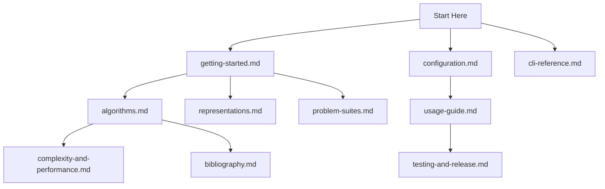

# EDAF Documentation Portal

This documentation set describes the current **v3-only** architecture and runtime behavior of EDAF.

## Read This First

- [Getting Started](./getting-started.md)
- [CLI Reference](./cli-reference.md)
- [Configuration Reference](./configuration.md)

## Architecture and Runtime

- [Architecture](./architecture.md)

## Components

- [Algorithms](./algorithms.md)
- [Representations](./representations.md)
- [Grammar-Based GP](./grammar-based-gp.md)
- [Problem Suites](./problem-suites.md)
- [Disjunct Matrix Family (DM/RM/ADM)](./disjunct-matrix-problems.md)
- [ADM Paper Suite Benchmark](./adm-paper-suite.md)
- [Boolean Function and Cryptography Suite](./crypto-boolean-problems.md)
- [COCO Integration](./coco-integration.md)
- [Extending the Framework](./extending-the-framework.md)

## Observability, Persistence, and Web

- [Latent Insights and Adaptive Control](./latent-insights.md)
- [Logging and Observability](./logging-and-observability.md)
- [Database Schema](./database-schema.md)
- [Web Dashboard and API](./web-dashboard.md)
- [Metrics and Results](./metrics-and-results.md)
- [Benchmark Comparisons](./benchmark-comparisons.md)
- [Complexity and Performance](./complexity-and-performance.md)
- [Testing and Release Hardening](./testing-and-release.md)
- [Bibliography](./bibliography.md)

## Operations

- [Usage Guide](./usage-guide.md)
- [Docker Guide](./docker.md)
- [Using EDAF as a Package](./using-edaf-as-package.md)
- [Release and Publishing (GitHub, Maven Central, RTD)](./release-and-publishing.md)
- [Implementation Status and Roadmap](./improvements.md)
