# EDAF Documentation

Welcome to the documentation hub for the **Estimation of Distribution Algorithms Framework (EDAF)**.
This index is organized by user intent: start quickly, understand core architecture, run benchmark suites, and operate reproducible research workflows.

```mermaid
flowchart TD
    A["Start"] --> B["Guides"]
    A --> C["Foundations"]
    A --> D["Runtime and Analytics"]
    A --> E["Benchmarks"]
    A --> F["Engineering and Release"]
    A --> G["API and References"]

    B --> B1["getting-started"]
    B --> B2["usage-guide"]
    B --> B3["docker"]

    C --> C1["architecture"]
    C --> C2["configuration"]
    C --> C3["algorithms + representations"]
    C --> C4["extending-the-framework"]

    D --> D1["web-dashboard"]
    D --> D2["database-schema"]
    D --> D3["latent-insights"]
    D --> D4["metrics-and-results"]

    E --> E1["problem-suites"]
    E --> E2["coco-integration"]
    E --> E3["disjunct-matrix + ADM suite"]

    F --> F1["testing-and-release"]
    F --> F2["release-and-publishing"]
    F --> F3["release-notes"]

    G --> G1["javadoc-api"]
    G --> G2["bibliography"]
```

## Quick Navigation

### Guides

- [Getting Started](./guides/getting-started.md)
- [Usage Guide](./guides/usage-guide.md)
- [Docker Guide](./guides/docker.md)
- [Using EDAF as a Package](./guides/using-edaf-as-package.md)

### Foundations

- [Architecture](./foundations/architecture.md)
- [Configuration Reference](./foundations/configuration.md)
- [CLI Reference](./foundations/cli-reference.md)
- [Algorithms](./foundations/algorithms.md)
- [Representations](./foundations/representations.md)
- [Grammar-Based GP](./foundations/grammar-based-gp.md)
- [Extending the Framework](./foundations/extending-the-framework.md)

### Runtime and Analytics

- [Web Dashboard and API](./runtime/web-dashboard.md)
- [Database Schema](./runtime/database-schema.md)
- [Latent Insights and Adaptive Control](./runtime/latent-insights.md)
- [Logging and Observability](./runtime/logging-and-observability.md)
- [Metrics and Results](./runtime/metrics-and-results.md)

### Benchmarks and Problem Families

- [Problem Suites](./benchmarks/problem-suites.md)
- [COCO Integration](./benchmarks/coco-integration.md)
- [Disjunct Matrix Family (DM/RM/ADM)](./benchmarks/disjunct-matrix-problems.md)
- [ADM Paper Suite](./benchmarks/adm-paper-suite.md)
- [Boolean/Cryptography Suite](./benchmarks/crypto-boolean-problems.md)
- [Benchmark Comparisons](./benchmarks/benchmark-comparisons.md)
- [Complexity and Performance](./benchmarks/complexity-and-performance.md)

### Engineering, Release, and Roadmap

- [Testing and Release Hardening](./engineering/testing-and-release.md)
- [Release and Publishing](./engineering/release-and-publishing.md)
- [Improvements and Roadmap](./engineering/improvements.md)
- [Release Notes](./release-notes/index.md)

### API and References

- [API JavaDoc Guide](./api/javadoc-api.md)
- [Bibliography](./references/bibliography.md)
