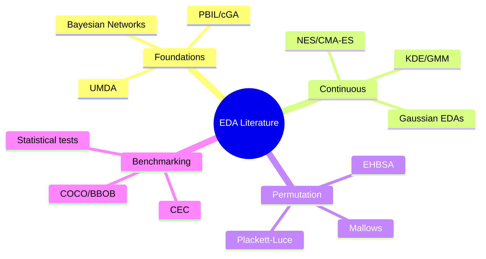

# EDA Bibliography

This bibliography is intended as a practical reference map for EDAF users who want to connect implementation choices to primary literature.

## 1) Core EDA foundations

[1] Larrañaga, P., & Lozano, J. A. (Eds.). (2001). *Estimation of Distribution Algorithms: A New Tool for Evolutionary Computation* (Vol. 2). Springer.

[2] Mühlenbein, H., & Paass, G. (1996). From recombination of genes to the estimation of distributions I. Binary parameters. In *PPSN IV* (pp. 178-187). Springer.

[3] Mühlenbein, H., Bendisch, J., & Voigt, H. M. (1996). From recombination of genes to the estimation of distributions II. Continuous parameters. In *PPSN IV* (pp. 188-197). Springer.

[4] Baluja, S. (1994). Population-based incremental learning: A method for integrating genetic search based function optimization and competitive learning. Technical Report CMU-CS-94-163, Carnegie Mellon University.

[5] Harik, G., Lobo, F., & Goldberg, D. E. (1999). The compact genetic algorithm. *IEEE Transactions on Evolutionary Computation*, 3(4), 287-297.

## 2) Discrete dependency modeling (BOA/EBNA/hBOA/tree models)

[6] Pelikan, M., Goldberg, D. E., & Cantú-Paz, E. (1999). BOA: The Bayesian optimization algorithm. In *GECCO* (pp. 525-532).

[7] Etxeberria, R., & Larrañaga, P. (1999). Global optimization using Bayesian networks. In *AISTATS*.

[8] Pelikan, M. (2005). *Hierarchical Bayesian Optimization Algorithm: Toward a New Generation of Evolutionary Algorithms*. Springer.

[9] Chow, C., & Liu, C. (1968). Approximating discrete probability distributions with dependence trees. *IEEE Transactions on Information Theory*, 14(3), 462-467.

[10] de Bonet, J. S., Isbell, C. L., & Viola, P. (1997). MIMIC: Finding optima by estimating probability densities. In *NIPS*.

## 3) Continuous EDAs and semiparametric models

[11] Larrañaga, P. (2000). Optimization in continuous domains by learning and simulation of Gaussian networks. In *GECCO Workshop Program*.

[12] Soloviev, V. P., Larrañaga, P., & Bielza, C. (2022). Estimation of distribution algorithms using Gaussian Bayesian networks to solve industrial optimization problems constrained by environment variables. *Journal of Combinatorial Optimization*, 44(2), 1077-1098.

[13] Soloviev, V. P., Bielza, C., & Larrañaga, P. (2023). Semiparametric Estimation of Distribution Algorithms for continuous optimization. *IEEE Transactions on Evolutionary Computation*.

[14] Luo, N., & Qian, F. (2009). Evolutionary algorithm using kernel density estimation model in continuous domain. In *Asian Control Conference* (pp. 1526-1531). IEEE.

[15] Kern, S., Müller, S. D., Hansen, N., Büche, D., Ocenasek, J., & Koumoutsakos, P. (2004). Learning probability distributions in continuous evolutionary algorithms: A comparative review. *Natural Computing*, 3, 77-112.

## 4) ES/NES/IGO/CMA-ES line

[16] Hansen, N., & Ostermeier, A. (2001). Completely derandomized self-adaptation in evolution strategies. *Evolutionary Computation*, 9(2), 159-195.

[17] Hansen, N. (2016). The CMA Evolution Strategy: A tutorial. *arXiv:1604.00772*.

[18] Wierstra, D., Schaul, T., Peters, J., & Schmidhuber, J. (2008). Natural evolution strategies. In *CEC*.

[19] Glasmachers, T., Schaul, T., Sun, Y., Wierstra, D., & Schmidhuber, J. (2010). Exponential natural evolution strategies. In *GECCO*.

[20] Ollivier, Y., Arnold, L., Auger, A., & Hansen, N. (2017). Information-geometric optimization algorithms: A unifying picture via invariance principles. *Journal of Machine Learning Research*, 18, 1-65.

## 5) Permutation and ranking EDAs

[21] Tsutsui, S. (2009). Probabilistic model-building genetic algorithms in permutation spaces and EHBSA. *Proceedings of GECCO Workshops*.

[22] Ceberio, J., Irurozki, E., & Lozano, J. A. (2012). A review on estimation of distribution algorithms in permutation-based combinatorial optimization problems. *Progress in Artificial Intelligence*, 1, 103-117.

[23] Fligner, M. A., & Verducci, J. S. (1986). Distance based ranking models. *Journal of the Royal Statistical Society Series B*, 48(3), 359-369.

[24] Luce, R. D. (1959). *Individual Choice Behavior: A Theoretical Analysis*. Wiley.

## 6) Multi-objective and indicator-based optimization

[25] Zitzler, E., Deb, K., & Thiele, L. (2000). Comparison of multiobjective evolutionary algorithms: Empirical results. *Evolutionary Computation*, 8(2), 173-195.

[26] Deb, K., Pratap, A., Agarwal, S., & Meyarivan, T. (2002). A fast and elitist multiobjective genetic algorithm: NSGA-II. *IEEE Transactions on Evolutionary Computation*, 6(2), 182-197.

[27] Fonseca, C. M., Paquete, L., & López-Ibáñez, M. (2006). An improved dimension-sweep algorithm for the hypervolume indicator. In *CEC*.

## 7) Benchmarking and statistical comparison

[28] Hansen, N., Auger, A., Finck, S., & Ros, R. (2012). Real-parameter black-box optimization benchmarking 2012: Experimental setup. *INRIA RR-7983*.

[29] COCO Platform. *COmparing Continuous Optimizers*. [https://coco-platform.org/](https://coco-platform.org/)

[30] NUMBBO/COCO documentation. [https://numbbo.github.io/coco/](https://numbbo.github.io/coco/)

[31] Derrac, J., García, S., Molina, D., & Herrera, F. (2011). A practical tutorial on the use of nonparametric statistical tests for comparing evolutionary and swarm intelligence algorithms. *Swarm and Evolutionary Computation*, 1(1), 3-18.

[32] Demšar, J. (2006). Statistical comparisons of classifiers over multiple data sets. *Journal of Machine Learning Research*, 7, 1-30.

[33] Holm, S. (1979). A simple sequentially rejective multiple test procedure. *Scandinavian Journal of Statistics*, 6(2), 65-70.

## 8) Problem-specific references used in EDAF

[34] Ackley, D. H. (1987). *A Connectionist Machine for Genetic Hillclimbing*. Kluwer.

[35] Rosenbrock, H. H. (1960). An automatic method for finding the greatest or least value of a function. *The Computer Journal*, 3(3), 175-184.

[36] Rastrigin, L. A. (1974). *Systems of Extremal Control*. Mir.

[37] Zitzler, E., Deb, K., & Thiele, L. (2000). ZDT benchmark suite definitions.

[38] Deb, K., Thiele, L., Laumanns, M., & Zitzler, E. (2005). Scalable test problems for evolutionary multiobjective optimization (DTLZ suite).

[39] Garey, M. R., & Johnson, D. S. (1979). *Computers and Intractability: A Guide to the Theory of NP-Completeness*. Freeman.

[40] CEC 2014 benchmark suite documentation.

## 9) Citation guide for EDAF users

Use this section to reference methods in reports:

- Baseline EDA concepts: [1], [2], [3]
- Binary factorized baselines: [2], [4], [5]
- Bayesian-network EDAs: [6], [7], [8]
- Continuous Gaussian/Bayesian-network EDAs: [11], [12], [15]
- Semiparametric/KDE variants: [13], [14]
- NES/CMA/IGO theory: [16], [17], [18], [19], [20]
- Permutation EDAs: [21], [22], [23], [24]
- Statistical tests: [31], [32], [33]

---
Estimation of Distribution Algorithms Framework  
Copyright (c) 2026 Dr. Karlo Knezevic  
Licensed under the Apache License, Version 2.0.
