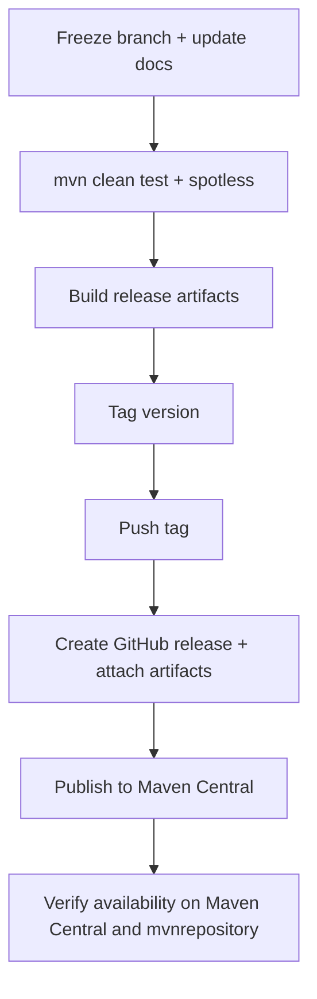
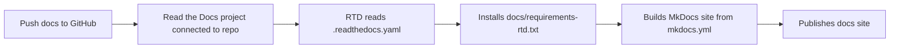

<p align="right"></p>

# Release, GitHub Packaging, Maven Central, and Read the Docs

This guide covers:

1. how to cut a GitHub release with reproducible artifacts
2. how to publish EDAF to Maven Central (which then appears on mvnrepository.com)
3. how to publish docs on Read the Docs

## 1) Release Flow Overview



## 2) Pre-release Quality Gate

From `/Users/karloknezevic/Desktop/EDAF`:

```bash
mvn -q clean test
mvn -q spotless:check
mvn -q -pl edaf-web -am package -DskipTests
docker compose build runner web
```

## 3) Build Artifacts for GitHub Release

```bash
cd /Users/karloknezevic/Desktop/EDAF
mvn -q -DskipTests package
```

Automated helper (recommended):

```bash
cd /Users/karloknezevic/Desktop/EDAF
./scripts/release/github-release.sh v3.0.0 --push-tag
```

Typical artifacts:

- `/Users/karloknezevic/Desktop/EDAF/edaf-cli/target/edaf-cli.jar`
- `/Users/karloknezevic/Desktop/EDAF/edaf-web/target/edaf-web-3.0.0.jar`
- module jars under each `*/target/`
- `/Users/karloknezevic/Desktop/EDAF/dist/v3.0.0/*` (local release bundle; intentionally ignored in git)

## 4) Versioning + Tagging

Recommended:

1. bump version in root `pom.xml` and all modules
2. commit version bump
3. create annotated tag

Example:

```bash
cd /Users/karloknezevic/Desktop/EDAF
git add -A
git commit -m "release: prepare v3.0.0"
git tag -a v3.0.0 -m "EDAF v3.0.0"
git push origin master
git push origin v3.0.0
```

## 5) GitHub Release (CLI)

Using GitHub CLI:

```bash
cd /Users/karloknezevic/Desktop/EDAF
gh release create v3.0.0 \
  --title "EDAF v3.0.0" \
  --notes-file docs/release-notes-v3.0.0.md \
  edaf-cli/target/edaf-cli.jar \
  edaf-web/target/edaf-web-3.0.0.jar
```

Script alternative (build + tag handling + asset upload):

```bash
cd /Users/karloknezevic/Desktop/EDAF
./scripts/release/github-release.sh v3.0.0 --push-tag
```

Automatic GitHub release on tags:

- workflow: `/Users/karloknezevic/Desktop/EDAF/.github/workflows/release-on-tag.yml`
- trigger: every pushed tag matching `v*` (for example `v3.0.1`)
- result: workflow creates or updates the GitHub release and attaches:
  - `edaf-cli.jar`
  - `edaf-web.jar`
  - `SHA256SUMS.txt`

## 6) GitHub Packages (Maven Registry)

EDAF root `pom.xml` already defines `distributionManagement` for:

- profile `github-packages`:
  - `https://maven.pkg.github.com/KarloKnezevic/EDAF`

Local deploy (from maintainer machine):

```bash
cd /Users/karloknezevic/Desktop/EDAF
mvn -Pgithub-packages -DskipTests deploy
```

Automated deploy:

- workflow: `.github/workflows/publish-github-packages.yml`
- triggers: release published or manual dispatch
- required permissions: `packages: write`

Typical server id in `~/.m2/settings.xml`:

```xml
<server>
  <id>github</id>
  <username>${env.GITHUB_ACTOR}</username>
  <password>${env.GITHUB_TOKEN}</password>
</server>
```

## 7) Maven Central vs mvnrepository.com

Important:

- **You do not publish directly to [mvnrepository.com](https://mvnrepository.com/).**
- You publish to **Maven Central**.
- mvnrepository indexes Maven Central automatically after synchronization.

## 8) Maven Central Publishing Checklist

### 8.1 Account and namespace

1. Create/login to [central.sonatype.com](https://central.sonatype.com/).
2. Claim namespace for your groupId (for example `io.github.karloknezevic`), usually via DNS TXT proof.
3. Create publishing token credentials.

### 8.2 GPG signing

Generate and publish GPG public key:

```bash
gpg --full-generate-key
gpg --list-secret-keys --keyid-format=long
gpg --keyserver keyserver.ubuntu.com --send-keys <KEY_ID>
```

### 8.3 Maven `settings.xml`

Configure credentials (example):

```xml
<settings>
  <servers>
    <server>
      <id>central</id>
      <username>${env.CENTRAL_PORTAL_USERNAME}</username>
      <password>${env.CENTRAL_PORTAL_PASSWORD}</password>
    </server>
  </servers>
</settings>
```

### 8.4 Artifact requirements

Central requires:

- compiled jar
- `-sources.jar`
- `-javadoc.jar`
- GPG signatures (`.asc`)
- POM metadata (license, scm, developers, etc.)

### 8.5 Deploy command (release profile)

After adding/activating your release profile for source/javadoc/sign/deploy:

```bash
cd /Users/karloknezevic/Desktop/EDAF
export MAVEN_GPG_PASSPHRASE='<your-gpg-passphrase>'
mvn -Pcentral-release -DskipTests \
  -Dcentral.auto.publish=false \
  -Dcentral.wait.until=validated \
  deploy
```

Important:

- `maven-gpg-plugin` in best-practices mode refuses passphrase from Maven properties or files.
- provide passphrase via `MAVEN_GPG_PASSPHRASE` environment variable (or use gpg-agent).
- EDAF uses CI-friendly versions (`${revision}`), so `flatten-maven-plugin` in `central-release` profile resolves deployed POM coordinates and inherited metadata for Central validation.

CI workflow:

- `.github/workflows/publish-maven-central.yml`
- triggers:
  - manual (`workflow_dispatch`)
  - pushed tag `v*`
- required GitHub secrets:
  - `CENTRAL_PORTAL_USERNAME`
  - `CENTRAL_PORTAL_PASSWORD`
  - `GPG_PRIVATE_KEY` (ASCII-armored private key)
  - `GPG_PASSPHRASE`

## 9) Post-publish Verification

1. verify on Maven Central search:
   - [https://central.sonatype.com/](https://central.sonatype.com/)
2. wait for mvnrepository indexing:
   - [https://mvnrepository.com/](https://mvnrepository.com/)
3. test consumption in a clean project:

```bash
mvn -q -U dependency:get -Dartifact=io.github.karloknezevic:edaf-core:3.0.0
```

## 10) Common Failure Modes

- missing signatures
- missing javadoc/sources jars
- invalid POM metadata (`scm`, license, developer)
- namespace ownership not verified
- wrong credentials ID in `settings.xml`

## 11) Publish Documentation on Read the Docs

EDAF includes ready RTD support files:

- `/Users/karloknezevic/Desktop/EDAF/.readthedocs.yaml`
- `/Users/karloknezevic/Desktop/EDAF/mkdocs.yml`
- `/Users/karloknezevic/Desktop/EDAF/docs/requirements-rtd.txt`

Flow:



Steps:

1. open [Read the Docs dashboard](https://readthedocs.io/dashboard/).
2. import repository `KarloKnezevic/EDAF`.
3. set default branch (`main` or `master`).
4. ensure build config points to `.readthedocs.yaml` (root).
5. trigger first build; verify pages and nav.
6. enable versioned docs (optional) from RTD admin.

Local pre-check:

```bash
cd /Users/karloknezevic/Desktop/EDAF
python3 -m venv .venv-docs
source .venv-docs/bin/activate
pip install -r docs/requirements-rtd.txt
mkdocs serve
```

Trigger RTD build from CLI:

```bash
cd /Users/karloknezevic/Desktop/EDAF
READTHEDOCS_PROJECT=<your-project-slug> \
READTHEDOCS_TOKEN=<token> \
./scripts/release/publish-readthedocs.sh
```

Open local docs preview:

- [http://127.0.0.1:8000](http://127.0.0.1:8000)
