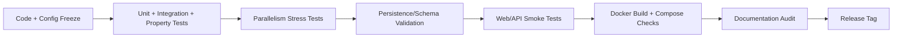
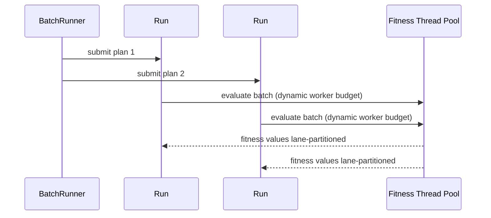

<p align="right"></p>

# Testing and Release Hardening Guide

This is the release checklist for EDAF v3. It focuses on correctness, parallel safety, persistence consistency, and deployability.

## 1) Release quality gates



Gate criteria:

1. `mvn -q clean test` passes from repository root.
2. Spotless check passes.
3. `edaf-web` packages successfully.
4. Docker runner and web images build from clean context.
5. Aggregated JavaDoc generation succeeds.
6. No generated artifacts pollute root directory.

## 2) Full test commands

## 2.1 Full repository

```bash
cd /Users/karloknezevic/Desktop/EDAF
mvn -q clean test
mvn -q spotless:check
```

## 2.2 Focused runtime/persistence/web

```bash
mvn -q -pl edaf-core,edaf-experiments,edaf-persistence,edaf-web -am test
mvn -q -pl edaf-web -am package -DskipTests
```

## 2.3 Fast pre-push sanity

```bash
mvn -q -pl edaf-core,edaf-experiments -am test
./edaf config validate configs/umda-onemax-v3.yml
./edaf run -c configs/umda-onemax-v3.yml --verbosity quiet
```

## 2.4 API JavaDoc generation

```bash
./scripts/docs/build-javadocs.sh
```

## 3) Parallelism validation

EDAF has two concurrency layers:

- run-level parallelism in `BatchRunner` (multi-run orchestration)
- in-run fitness evaluation parallelism in `AbstractEdaAlgorithm.evaluateFitnessBatch`



Parallel safety checks implemented in tests:

- `ExecutionParallelismTest`:
  - active-run lease accounting
  - monotonic worker budget under increased active runs
  - concurrent lease lifecycle under stress
- `ParallelFitnessDeterminismTest`:
  - same seeded run under low and high run-pressure yields identical final result

## 4) Persistence and schema checks

Run:

```bash
mvn -q -pl edaf-persistence -am test
```

Key coverage:

- schema initializer behavior (legacy detection + safe reset + idempotent re-init)
- run query filtering/sorting/pagination
- COCO repository query model

## 5) Web/API smoke checks

## 5.1 Local run

```bash
./edaf run -c configs/umda-onemax-v3.yml --verbosity quiet
EDAF_DB_URL=jdbc:sqlite:edaf-v3.db java -jar edaf-web/target/edaf-web-*.jar
```

Manual checklist:

1. `/` shows runs and pagination.
2. `/experiments` shows grouped experiments with status.
3. Run detail page opens charts and tables without overflow.
4. Header/footer branding appears on all pages.
5. Search/sort/filter endpoints return stable data:
   - `/api/runs`
   - `/api/experiments`
   - `/api/facets`

## 6) Docker release checks

## 6.1 Build images

```bash
docker build -f Dockerfile.runner -t edaf-runner:release-check .
docker build -f Dockerfile.web -t edaf-web:release-check .
docker compose build runner web
docker compose config >/tmp/edaf-compose.resolved.yml
```

Note: EDAF now includes `.dockerignore` to prevent massive build context uploads from runtime artifacts.

## 6.2 Compose bring-up smoke

```bash
docker compose up -d db web
docker compose logs --tail=100 web
curl -fsS http://localhost:7070/ >/dev/null
docker compose down
```

## 7) Root hygiene (release packaging)

Generated runtime artifacts should stay outside source control:

- local DB files (`*.db`, `*.db-shm`, `*.db-wal`)
- run logs (`*.log`)
- benchmark outputs (`results/`, `reports/`)
- temporary build output (`target/`)
- jqwik caches (`.jqwik-database`)

Use:

```bash
git status --short
```

Before release, confirm no accidental runtime artifacts are staged.

## 8) Failure triage matrix

| Symptom | Likely cause | First action |
| --- | --- | --- |
| `SQLITE_BUSY` | concurrent writes + aggressive polling | reduce polling, prefer PostgreSQL for heavy campaigns |
| run stuck in `RUNNING` after crash | abrupt termination before completion event | use stop endpoint + status reconciliation scripts |
| docker build context huge | missing `.dockerignore` | verify ignored runtime directories and DB files |
| non-deterministic seeded run | hidden shared mutable state or non-deterministic ordering | run `ParallelFitnessDeterminismTest`, inspect evaluator streams |

## 9) Release sign-off template

```text
Release candidate:
- Commit:
- Java:
- Maven:
- Full tests: PASS/FAIL
- Spotless: PASS/FAIL
- Docker runner build: PASS/FAIL
- Docker web build: PASS/FAIL
- Compose config validation: PASS/FAIL
- Docs updated: YES/NO
- Known limitations:
```

For tagging, GitHub release assets, Maven Central deployment, and Read the Docs publication:

- [Release and Publishing Guide](./release-and-publishing.md)
