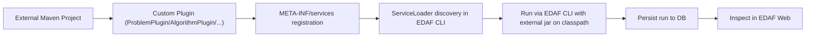

<p align="right"></p>

# Using EDAF as a Package in Another Project

This guide shows how to consume EDAF from an external Maven project, add your own component, run it, and monitor it in the EDAF web dashboard.

## 1) Integration Model



## 2) Working Example in This Repository

External sample package:

- `/Users/karloknezevic/Desktop/EDAF/examples/external-package-sample`

It contains:

- custom problem class:
  - `/Users/karloknezevic/Desktop/EDAF/examples/external-package-sample/src/main/java/com/example/edaf/extensions/problems/LeadingOnesProblem.java`
- plugin factory:
  - `/Users/karloknezevic/Desktop/EDAF/examples/external-package-sample/src/main/java/com/example/edaf/extensions/problems/LeadingOnesProblemPlugin.java`
- service registration:
  - `/Users/karloknezevic/Desktop/EDAF/examples/external-package-sample/src/main/resources/META-INF/services/com.knezevic.edaf.v3.core.plugins.ProblemPlugin`
- runnable config:
  - `/Users/karloknezevic/Desktop/EDAF/examples/external-package-sample/sample-leading-ones.yml`

## 3) Minimal Custom Problem Example (Your Own Code)

Below is a minimal shape of a custom problem implementation and plugin registration pattern.

```java
public final class LeadingOnesProblem implements Problem<BitString> {
    @Override
    public ScalarFitness evaluate(Individual<BitString> individual, AlgorithmContext<BitString> context) {
        int leading = 0;
        boolean[] bits = individual.genotype().bits();
        while (leading < bits.length && bits[leading]) {
            leading++;
        }
        return ScalarFitness.maximization((double) leading);
    }
}
```

```java
public final class LeadingOnesProblemPlugin implements ProblemPlugin<BitString> {
    @Override
    public String type() {
        return "leading-ones";
    }

    @Override
    public Problem<BitString> create(ExperimentConfig config, Representation<BitString> representation) {
        return new LeadingOnesProblem();
    }
}
```

Service registration file:

- `META-INF/services/com.knezevic.edaf.v3.core.plugins.ProblemPlugin`

Content:

```text
com.example.edaf.extensions.problems.LeadingOnesProblemPlugin
```
## 4) Build + Run Commands

### 4.1 Build EDAF jars

```bash
cd /Users/karloknezevic/Desktop/EDAF
mvn -q -pl edaf-cli,edaf-web -am package -DskipTests
```

### 4.2 Build external package

```bash
cd /Users/karloknezevic/Desktop/EDAF/examples/external-package-sample
mvn -q package
```

### 4.3 Run EDAF CLI with your plugin jar

Use classpath mode so ServiceLoader sees both jars:

```bash
cd /Users/karloknezevic/Desktop/EDAF
java -cp "examples/external-package-sample/target/edaf-external-package-sample-1.0.0-SNAPSHOT.jar:edaf-cli/target/edaf-cli.jar" \
  com.knezevic.edaf.v3.cli.EdafCli run -c examples/external-package-sample/sample-leading-ones.yml --verbosity normal
```

### 4.4 Open web dashboard for this external run DB

```bash
cd /Users/karloknezevic/Desktop/EDAF
EDAF_DB_URL="jdbc:sqlite:$(pwd)/examples/external-package-sample/external-edaf.db" \
  java -jar edaf-web/target/edaf-web-3.0.0.jar
```

Open:

- [http://localhost:7070](http://localhost:7070)

Then inspect run:

- `external-leading-ones-demo`

## 5) Web Tracking Checklist for External Plugins

To ensure your external component is visible in EDAF web:

1. use DB sink in your YAML (`persistence.sinks` includes `db`)
2. point run and web app to the same DB URL
3. ensure `run.id` is unique
4. verify your plugin `type()` value appears in `algorithm/problem/model` cards

Useful API checks:

- `GET /api/runs?q=external-leading-ones-demo`
- `GET /api/runs/{runId}`
- `GET /api/runs/{runId}/iterations`

## 6) How to Add Your Own Component Type

Supported extension points:

- `RepresentationPlugin<G>`
- `ProblemPlugin<G>`
- `ModelPlugin<G>`
- `AlgorithmPlugin<G>`

Required pattern:

1. implement interface
2. return stable `type()` string
3. register class in `META-INF/services/...`
4. reference `type` in YAML config

## 7) Validation Checklist

Before using custom package in production experiments:

1. run `mvn -q clean test` in external package
2. run one short EDAF smoke config with external plugin
3. verify run persisted in DB and visible in web
4. verify logs and report artifacts in output directories
